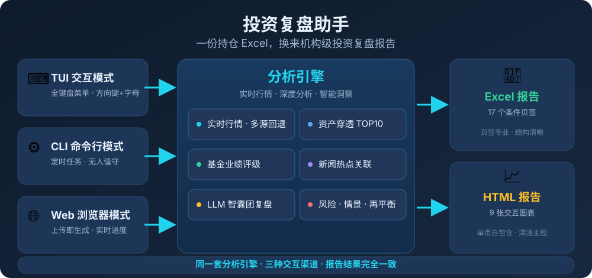
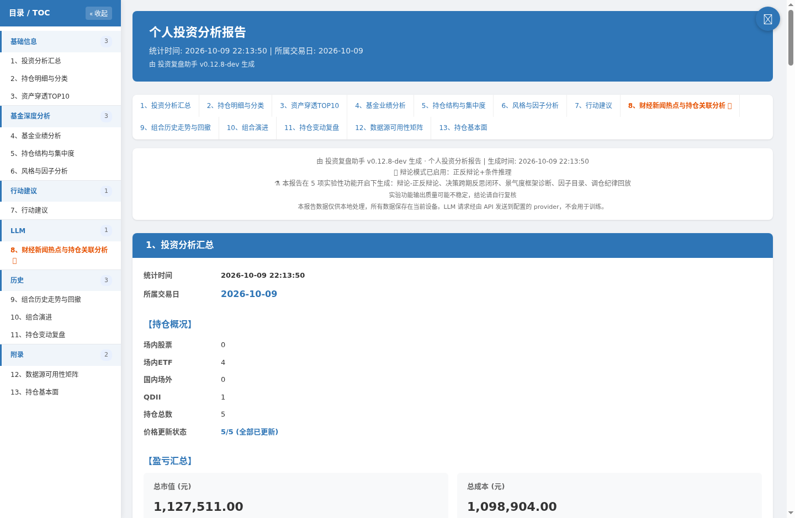
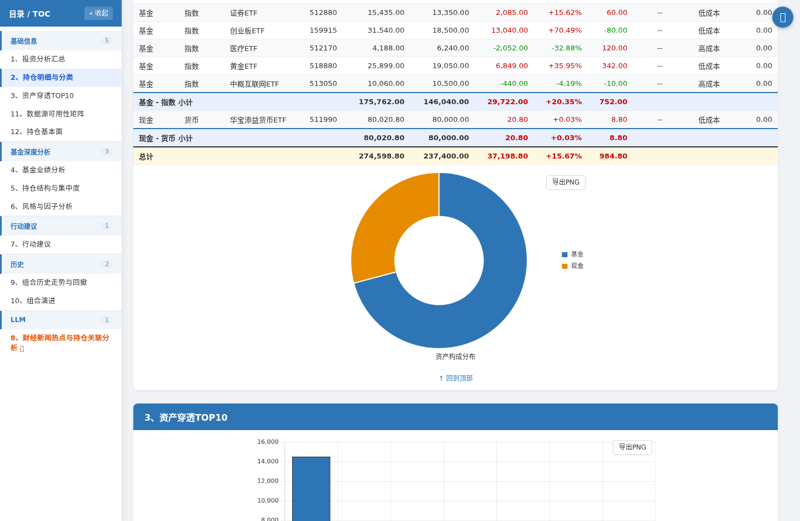
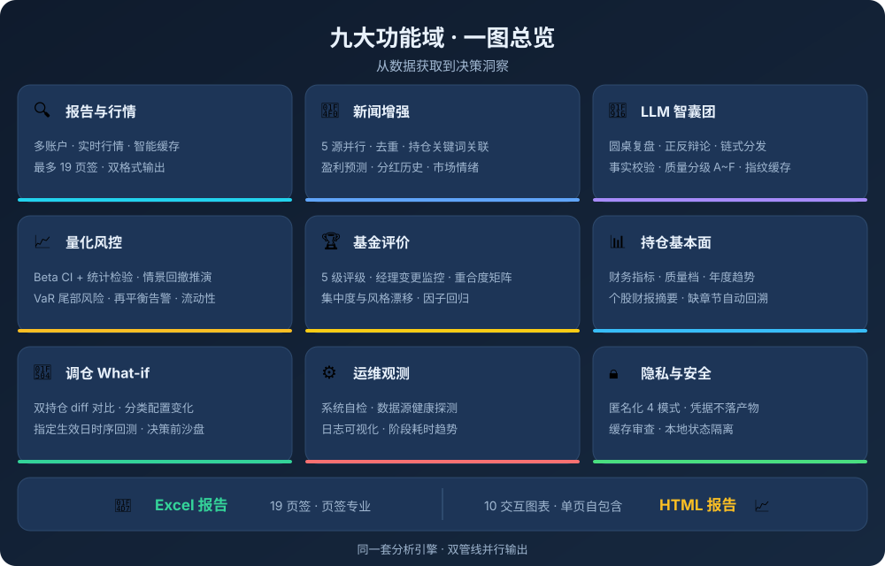

# 投资复盘助手

[](https://github.com/yatwql/investor-util/releases)
[](https://github.com/yatwql/investor-util/actions/workflows/ci.yml)
[](https://www.python.org)
[]()
[](LICENSE)

> **一份持仓 Excel，换来一份机构级的投资复盘报告。**

面向个人投资者的**本地优先**投资分析引擎：实时行情 · 资产穿透 · 基金评级 · 量化风控 · LLM 智囊团深度复盘——全部跑在你自己的机器上，持仓数据不出本机，报告即开即用。



**为什么值得尝试？**

- 🎯 **零门槛上手** — 把你的持仓表丢给它，几分钟后拿到 Excel + HTML 双格式专业报告，不需要写一行代码
- 🧠 **不只是数据罗列** — LLM 智囊团圆桌复盘、正反辩论、事实校验、质量分级，输出的是**观点**而不只是数字
- 🔍 **穿透到底** — 基金/ETF 拆成真实持仓再合并分析，伪分散、重合度、风格漂移无处可藏
- 🛡️ **把风险量化** — Beta 置信区间、情景回撤推演、VaR 尾部风险、流动性变现天数，用数字代替直觉
- 🔁 **决策有闭环** — 建议 → 登记 → 真实行情结算命中率 → 教训回灌提示词，越用越懂你的组合
- 🔒 **隐私优先** — 数据全部本地处理，支持 4 档匿名化，凭据永不落日志与报告

> 当前版本：0.12.4（[版本历史](docs/managements/changelog.md)）

## ✨ 核心亮点

八个让它脱颖而出的地方：

| 亮点 | 说明 |
|:---|:---|
| **一次持仓，三种用法** | 同一套引擎、三种入口，产物与配置完全一致：**TUI**（全键盘菜单，18 项 + 子菜单）· **CLI**（参数驱动，Windows 任务计划 / cron 无人值守）· **Web**（浏览器上传 → 选格式 → 看进度 → 预览/下载 + 配置编辑面板） |
| **全量专业报告，双格式** | **Excel** 最多 17 个条件页签（按开关自动显隐，不留空壳）；**HTML** 单页自包含、响应式布局、**9 张 Chart.js 交互图表**（悬停看精确值、可缩放、一键导出 PNG）+ 深浅色主题切换——手机上看也不翻车 |
| **穿透到真实持仓** | 基金/ETF 拆解为底层标的合并排序（TOP10），**ETF 联接基金按目标 ETF 穿透**；标注各基金报告期与「未折算持有比例」，不做精确性误导 |
| **量化风控成体系** | Beta 置信区间 + t/p 检验、6 种涨跌情景回撤推演（CI 传播）、尾部风险（VaR 95/99、最长连跌、恢复天数）、再平衡超限告警、流动性变现天数、币种敞口——机构风控的个人版 |
| **真正把 LLM 用成智囊团** | 三阶段圆桌复盘（召集令→辩论→定音锤）+ 可选正反辩论/条件推理/集中度问答；输出自动附**事实校验**（数值/品种/排名回查）与**质量分级** A~F；多 Provider 链式分发（priority / weighted / cost_first / fallback_only），失败自动递补；分析先核对申购限购可执行性（限大额 / 暂停申购不进不实建议） |
| **数据可信度可追溯** | 每个数据源都有主备链路与可读降级原因；报告内**数据源可用性矩阵**含「命中源」列（本次实际由谁服务）；**模块级质量分级**与**确定性信号沉淀**（实时/非实时来源标签）防止降级数据冒充战绩 |
| **决策闭环** | 行动建议（再平衡 + 交易纪律 + 调仓建议 + 收益归因）→ 决策登记 → 真实行情结算命中率 → 教训回灌专家复盘提示词（实验开关 `decision_reflection`）——每一次判断都会被事后检验 |
| **调仓 What-if 推演** | 双持仓 diff + 指定生效日时序回测（区间/年化收益、波动率、夏普、最大回撤）+ 目标持仓申购受限提示（限大额估算交易日 / 暂停申购引用下一开放日），独立产物 `调仓模拟.xlsx` / `.html`，决策前先沙盘 |

## 📸 实际报告效果

由示例持仓（公开指数 ETF，本机真实行情）生成的 HTML 报告实景：





## 环境要求

- **Python ≥ 3.11**（3.10 已于 2026‑10 终止支持）
- **操作系统**：Windows 10/11、Linux、macOS

## 三分钟上手

```bash
git clone https://github.com/yatwql/investor-util.git && cd investor-util
./scripts/launch.sh        # Linux/macOS（首次自动建 venv、装依赖）
# Windows： .\scripts\launch.ps1
```

启动后按提示放入持仓 Excel（格式：每张工作表一个账户，固定 4 列——名称/代码/份额/成本），几分钟内拿到双格式报告。更完整的首次使用指引见 [快速开始](docs/manuals/how-to-start.md)。

## 启动方式

同一套引擎，三种交互渠道——按你的场景选一个即可，报告结果完全一致：

### TUI 交互模式（菜单操作）

```bash
.\scripts\launch.ps1   # Windows
./scripts/launch.sh     # Linux
```

全键盘菜单：方向键导航 + 字母/数字快捷键，`[D]` 等入口带二级子菜单。各菜单详解见 [TUI 菜单操作手册](docs/manuals/how-to-use-tui-menu.md)。

### Web 浏览器模式

```bash
./scripts/launch.sh web   # Linux/macOS，默认 http://127.0.0.1:8000
.\scripts\launch.ps1 web  # Windows
```

标签页工作台（五区）：**生成报告**（① 上传 → ② 生成 → ④ 实时进度 → ⑤ 结果预览/下载）· **调仓模拟**（What-if 独立报告）· **配置**（③ 与 TUI 菜单同源）· **运行状态**（⑥ 系统信息 / 数据源健康 / 最近运行 / 系统自检 / 缓存管理）· **日志**（⑦）。详见 [Web 浏览器模式使用指南](docs/manuals/how-to-use-web-mode.md)。

### CLI 命令行模式（定时任务驱动）

```bash
# 生成基础 Excel 报告
.venv/bin/python -m src.python.cli report --type basic

# 生成全量报告（含 LLM）
.venv/bin/python -m src.python.cli report --type full --history auto

# 更新缓存 / 查看缓存状态
.venv/bin/python -m src.python.cli cache --update all
.venv/bin/python -m src.python.cli cache --stats

# 系统自检（配置损坏时仍可用）
.venv/bin/python -m src.python.cli doctor

# 单次运行启用实验功能（仅本次生效，不写入 features.json）
.venv/bin/python -m src.python.cli --experiment prosperity_framework report --type full
```

完整命令参考、退出码与定时任务配置见 [CLI 命令行模式使用指南](docs/manuals/how-to-use-cli-mode.md)。
想单次试运行实验功能？加 `--experiment 开关名`（只开不关）或 `--feature 名称=on/off`（双向）——仅本次运行生效，不写配置，详见手册 §全局参数。

---

## 🗺️ 功能地图

完整细节不在此罗列——每张图指向对应手册，想看哪块点哪块：



| 能力域 | 一句话介绍 | 深入阅读 |
|:---|:---|:---|
| 📄 报告与行情 | 多账户核算、双格式报告（Excel 17 页签 + HTML 9 图）、智能缓存、主备链路与「命中源」可追溯 | [报告文件结构](docs/manuals/reports-instruction.md) · [数据源一览](docs/manuals/datasource.md) |
| 📰 新闻增强 | 5 源财经新闻并行采集、去重、按持仓关键词关联；盈利预测、分红历史、市场情绪热点 | [报告文件结构](docs/manuals/reports-instruction.md) |
| 🤖 LLM 智囊团 | 圆桌复盘 + 正反辩论、事实校验、质量分级 A~F、多 Provider 链式分发、深度档位、幻觉率评估 | [LLM 配置指引](docs/manuals/how-to-config-llm.md) · [LLM 技术要点](docs/managements/llm-technical.md) |
| 📈 量化风控 | Beta 置信区间 + 统计检验、情景回撤推演、VaR 尾部风险、再平衡告警、流动性变现天数、币种敞口 | [报告文件结构](docs/manuals/reports-instruction.md) |
| 🏆 基金评价 | 5 级评级、经理变更监控、重合度矩阵、集中度与风格漂移、因子回归、候选基金比较 | [报告文件结构](docs/manuals/reports-instruction.md) |
| 📊 持仓基本面 | 财务指标 + 质量档、个股财报摘要（缺章节自动回溯）、穿透标的来源区分 | [报告文件结构](docs/manuals/reports-instruction.md) |
| 🔄 调仓模拟 | 双持仓 diff + 指定生效日时序回测，决策前先沙盘 | [Web 浏览器模式使用指南](docs/manuals/how-to-use-web-mode.md) · [CLI 命令行模式使用指南](docs/manuals/how-to-use-cli-mode.md) |
| ⚙️ 运维观测 | 系统自检、数据源健康探测、日志可视化、缓存统计与清理、阶段耗时持久化 | [TUI 菜单操作手册](docs/manuals/how-to-use-tui-menu.md) · [数据源可靠性文档](docs/manuals/datasource-reliability.md) |
| 🔒 隐私安全 | 4 档匿名化、凭据不落产物、缓存审查、本地状态隔离 | [常规配置指引](docs/manuals/how-to-config.md) |

> 数据从哪来、可靠性如何、挂了会怎样降级？见 [数据源可靠性文档](docs/manuals/datasource-reliability.md)；想调开关、TTL、章节可见性，见 [常规配置指引](docs/manuals/how-to-config.md)。

---

## 📖 用户指南

建议按以下顺序阅读：

| # | 文档 | 说明 |
|:-:|:-----|:------|
| 1 | [快速开始](docs/manuals/how-to-start.md) | 启动方式、持仓格式、首次使用指引 |
| 2 | [TUI 菜单操作手册](docs/manuals/how-to-use-tui-menu.md) | 各菜单详解（含 `[D]` 目录配置子菜单）、报告内容对照、缓存管理 |
| 3 | [CLI 命令行模式使用指南](docs/manuals/how-to-use-cli-mode.md) | 命令结构、全局参数（`--experiment` / `--feature`）、各子命令、退出码、定时任务 |
| 4 | [Web 浏览器模式使用指南](docs/manuals/how-to-use-web-mode.md) | 五区标签页工作台：生成报告 / 调仓模拟 / 配置 / 运行状态（含缓存管理）/ 日志 |
| 5 | [常规配置指引](docs/manuals/how-to-config.md) | `config.json` 字段说明、数据源、缓存 TTL、章节可见性、功能开关 |
| 6 | [LLM 配置指引](docs/manuals/how-to-config-llm.md) | 接入 LLM 分析、参数调优、多 Provider 策略、端点级节流、定价 |
| 7 | [报告文件结构](docs/manuals/reports-instruction.md) | Excel/HTML 报告逐章说明、基金业绩评价、投资知识点 |
| 8 | [数据源一览](docs/manuals/datasource.md) | 数据源、缓存前缀、数据质量与常见问题 |
| 9 | [数据源可靠性文档](docs/manuals/datasource-reliability.md) | 运维视角：可靠度评级、降级策略、限流规则、已知问题 |
| 10 | [常见问题解答](docs/manuals/faq.md) | 使用中的高频问题，按类别组织 |

## 🤝 参与贡献

这个项目欢迎你的加入——无论是**提需求、报 Bug、改进文档，还是提交代码**。

**这是一个把工程质量当真的一人项目**，对贡献者意味着：

- ✅ **8,000+ 测试用例**（verify + regression 近 5,800 项）+ 场景化回归套件，改动有底气
- ✅ **8 个 CI 守护脚本**把历史教训变成硬门禁：代码痕迹检查、文档一致性、需求追溯、语义命名索引、测试冗余审计、版本号一致性——文档与代码永不漂移
- ✅ **P0/P1/P2 三级门禁**：提交、合并、发布各有明确的通过标准，CI 矩阵覆盖 Python 3.11/3.12/3.13 + Windows 可移植性 + 非 UTF-8 locale 探测
- ✅ **清晰的协作契约**：[开发者指南](docs/managements/developer-guide.md) 写明了工作流、任务编号规范与发布流程；[需求文档](docs/managements/requirements.md) 与 [测试标准](docs/managements/testplan.md) 让每个需求可追溯、每个缺陷有回归用例

想动手？从 [开发者指南](docs/managements/developer-guide.md) 开始，跑通 P0 门禁就是你第一个 PR 的起点。发现数据不准、报告缺章、LLM 结论离谱——都欢迎在 issue 中带着持仓样例来提。

## 🔧 开发者参考

| 文档 | 说明 |
|:-----|:------|
| [开发者指南](docs/managements/developer-guide.md) | 开发环境与工作流、三级门禁（P0/P1/P2）、任务编号规范、测试驱动、辅助脚本速查、注册表使用、版本发布流程 |

## 📋 项目内部文档

以下为项目管理和技术设计文档，供维护者与开发者参考，普通用户无需阅读：

| 文档 | 说明 |
|------|------|
| [迭代计划](docs/managements/plan.md) | 迭代计划 |
| [需求文档](docs/managements/requirements.md) | 完整需求定义 |
| [技术设计](docs/managements/technical.md) | 技术设计与架构设计约束（含各约束的设计目的与违反后果） |
| [LLM 技术要点](docs/managements/llm-technical.md) | LLM 客户端架构与技术细节 |
| [质量控制与测试标准](docs/managements/testplan.md) | 质量控制与测试标准 |
| [测试覆盖情况](docs/managements/test-coverage.md) | 测试覆盖情况 |
| [自审记录](docs/managements/review-findings.md) | 自我审查问题记录 |
| [变更日志](docs/managements/changelog.md) | 版本更新记录 |
| [目录结构及文件概览](docs/managements/folders.md) | 目录结构及文件概览 |
| [CLAUDE.md](CLAUDE.md) | AI 编程助手指引 |
