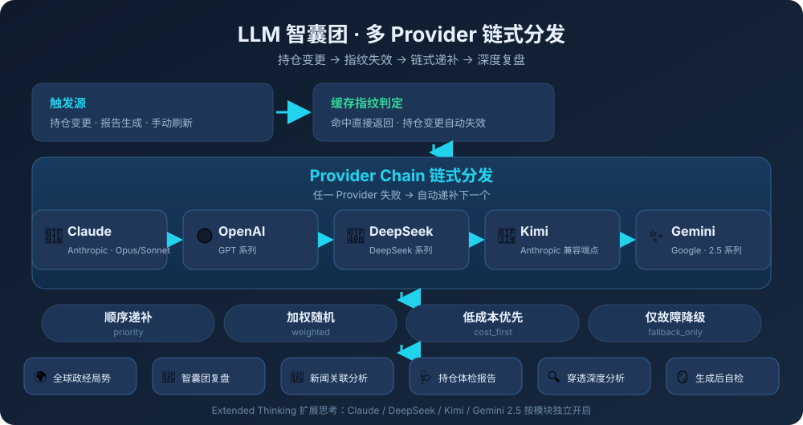

# 投资复盘助手

**把持仓 Excel 变成决策级投资洞察。** 一个面向个人投资者的本地投资分析引擎——实时行情 · 资产穿透 · 基金评级 · 量化风控 · LLM 智囊团深度复盘，双报告输出，让每一次投资决策都建立在数据之上。

> 当前版本：0.11.9-dev


## ✨ 核心亮点

| 亮点 | 说明 |
|:---|:---|
| **一次持仓，三种用法** | 同一套引擎、三种入口：**TUI**（全键盘菜单，18 项 + 子菜单）· **CLI**（参数驱动，Windows 任务计划 / cron 无人值守）· **Web**（浏览器上传 → 选格式 → 看进度 → 预览/下载 + 配置编辑面板）。产物与配置完全一致 |
| **全量专业报告，双格式** | **Excel** 最多 17 个条件页签（按开关自动显隐，不留空壳）；**HTML** 单页自包含、响应式布局、**9 张 Chart.js 交互图表**（悬停看精确值、可缩放、一键导出 PNG）+ 深浅色主题切换 |
| **穿透到真实持仓** | 基金/ETF 拆解为底层标的合并排序（TOP10），**ETF 联接基金按目标 ETF 穿透**；标注各基金报告期与「未折算持有比例」，不做精确性误导 |
| **量化风控成体系** | Beta 置信区间 + t/p 检验、6 种涨跌情景回撤推演（CI 传播）、尾部风险（VaR 95/99、最长连跌、恢复天数）、再平衡超限告警、流动性变现天数、币种敞口 |
| **真正把 LLM 用成智囊团** | 三阶段圆桌复盘（召集令→辩论→定音锤）+ 可选正反辩论/条件推理/集中度问答；输出自动附**事实校验**（数值/品种/排名回查）与**质量分级** A~F；多 Provider 链式分发（priority / weighted / cost_first / fallback_only），失败自动递补 |
| **数据可信度可追溯** | 每个数据源都有主备链路与可读降级原因；报告内**数据源可用性矩阵**含「命中源」列（本次实际由谁服务）；**模块级质量分级**与**确定性信号沉淀**（实时/非实时来源标签）防止降级数据冒充战绩 |
| **决策闭环** | 行动建议（再平衡 + 交易纪律 + 调仓建议 + 收益归因）→ 决策登记 → 真实行情结算命中率 → 教训回灌专家复盘提示词（实验开关 `decision_reflection`） |
| **调仓 What-if 推演** | 双持仓 diff + 指定生效日时序回测（区间/年化收益、波动率、夏普、最大回撤），独立产物 `调仓模拟.xlsx` / `.html`，决策前先沙盘 |

## 环境要求

- **Python ≥ 3.11**（3.10 已于 2026‑10 终止支持）
- **操作系统**：Windows 10/11、Linux、macOS

## 启动方式

同一套引擎，三种交互渠道——按你的场景选一个即可，报告结果完全一致：

### TUI 交互模式（菜单操作）

```bash
.\scripts\launch.ps1   # Windows
./scripts/launch.sh     # Linux
```

全键盘菜单：方向键导航 + 字母/数字快捷键，`[D]` 等入口带二级子菜单。各菜单详解见 [TUI 菜单操作手册](docs-stm/manuals/how-to-use-tui-menu.md)。

### Web 浏览器模式

```bash
./scripts/launch.sh web   # Linux/macOS，默认 http://127.0.0.1:8000
.\scripts\launch.ps1 web  # Windows
```

七步卡片式流程：① 上传持仓 → ② 生成报告 → ③ 配置编辑（与 TUI 菜单同源）→ ④ 实时进度 → ⑤ 结果预览/下载 → ⑥ 运行状态（系统信息 / 数据源健康 / 最近运行 / 系统自检）→ ⑦ 日志查看。详见 [Web 浏览器模式使用指南](docs-stm/manuals/how-to-use-web-mode.md)。

### CLI 命令行模式（定时任务驱动）

```bash
# 生成基础 Excel 报告
.venv/bin/python -m src.python.cli report --type basic

# 生成全量报告（含 LLM）
.venv/bin/python -m src.python.cli report --type full --history auto

# 更新缓存 / 查看缓存状态
.venv/bin/python -m src.python.cli cache --update all
.venv/bin/python -m src.python.cli cache --stats

# 系统自检（配置损坏时仍可用）
.venv/bin/python -m src.python.cli doctor

# 单次运行启用实验功能（仅本次生效，不写入 features.json）
.venv/bin/python -m src.python.cli --experiment signal_ledger report --type full
```

完整命令参考（全局参数 / report / cache / whatif / check-sources / view-logs / doctor / 退出码 / 最佳实践；开发维护命令 `cassettes` 见开发者指南）见 [CLI 命令行模式使用指南](docs-stm/manuals/how-to-use-cli-mode.md)，定时任务见其 §13。
`--experiment` 为全局参数，取值接受开关名（如 `signal_ledger`）、显示名或 `all`，可重复指定，只作用于**实验组**且只开不关。
`--feature NAME=VALUE` 是它的补集：面向**全部 30 项功能开关**、**双向**（`=off` 亦可），仅本次运行、不写入 `features.json`，在其之后应用——`--experiment all --feature signal_ledger=off` 即「其余实验功能全开、只关信号沉淀」。

---

## 功能特性


### 🔍 报告与行情

- **多账户支持** — Excel 每张工作表为一个独立账户，自动识别并分账户小计
- **行情与净值** — 场内实时价（腾讯财经 → 新浪财经 → 同花顺）、场外基金净值（东方财富 → 新浪财经跨厂商备源）；**00 重叠区代码按名称消歧**（如 `002943` 既是股票也是场外基金，价格/历史/分红/行业各域均按持仓名称路由，绝不串味）
- **智能缓存** — 分类型 TTL（盘中行情 30s、基金持仓 7 天、行业 14 天、财报 30 天…）+ 会话缓存去重 + 菜单/CLI 可清理与统计
- **需凭据的数据源（均为可选，未配置即自动跳过并给申请指引）**
  - **财报全文** — DataSinking 全文本财报（仅 A 股），配于 `data/config/data_key.json` 的 `datasink` 节或环境变量 `DATASINK_API_KEY`；主源不可用时由**巨潮资讯网**备源接管
  - **同花顺金融数据** — 官方 A 股数据服务，用作行情/历史日 K/交易日历/财务指标/基金披露持仓的**兜底槽位**；配于 `data_key.json` 的 `hithink` 节或 `HITHINK_FINANCE_API_KEY`
- **Excel 报告** — 最多 17 个条件页签，按开关自动显隐：
  - **基础核算**：投资分析汇总、持仓明细与分类（市值明细 15 列 + 分类汇总 10 列）、资产穿透 TOP10、基金业绩分析（5 级评级 + 基金经理变更监控块）、数据源可用性矩阵（含「命中源」列与数据源说明表）
  - **基金深度分析**：持仓结构与集中度（重合度 + 相关性 + 集中度）、风格与因子分析（风格表 + 因子回归 + 行业 Beta 子表）
  - **行动建议**：再平衡信号 + 交易纪律 + 调仓建议 + 收益归因（默认开）
  - **历史**：组合历史走势与回撤（走势表 + 回撤矩阵 + 危机区间标注 + 尾部风险）、组合演进（净值/结构/HHI 趋势）
  - **持仓基本面**（可选）：财务指标区块（含质量档与年度趋势）+ 持仓个股财报摘要区块
  - **新闻**：财经新闻热点与持仓关联分析
  - **LLM 分析**：全球政经局势、智囊团深度复盘、持仓体检报告、穿透深度分析、LLM API 用量
- **HTML 报告** — 单页自包含（移动/单发不失效）、响应式、盈亏着色、9 张 Chart.js 交互图表（主报告 6 + 组合演进 3）、每图附「图下说明」

### 📰 新闻与数据增强

- **多源财经新闻** — 新浪财经 + 东方财富 + 财联社 + 华尔街见闻 + akshare（财新网/CCTV）5 源并行获取，去重后与持仓关键词关联
- **行业/概念关键词扩展** — 自动获取东方财富三级行业分类与概念板块，扩充新闻匹配面（仅对 A 股个股取数）
- **机构盈利预测** — akshare 研报覆盖、预测 EPS、机构评级，穿透 TOP10 与基金业绩同步展示
- **分红历史分析** — 个股历年分红汇总，年均股息率（分类汇总）与年均股息金额（穿透 TOP10）
- **市场情绪与资金热点**（报告开关 `market_sentiment`，默认关）— 龙虎榜 / 连板梯队事件与持仓·穿透标的联动，落于行动建议章内嵌块

### 🤖 LLM 分析

- **多 Provider 链式分发** — `llm_providers.json` 支持 priority（顺序递补）/ weighted（加权随机）/ cost_first（低成本优先）/ fallback_only（仅故障降级），失败自动递补；端点级节流与并发治理（`pacing`）
- **Extended Thinking** — Claude、DeepSeek（Anthropic 兼容端点）、Kimi（Anthropic 兼容端点）与 Gemini 2.5 的扩展思考模式，按模块独立开启
- **每模块独立控制** — 菜单 `[S]` 交互切换 5 个 LLM 模块启停，立即生效无需重启
- **事实校验** — 对 LLM 输出中的数值/品种/排名回查真实数据，自动纠正并记录修正处
- **模块级质量分级**（常规开关，默认开，`module_quality_gate`）— 按**完整性 + 篇幅**评 A~F；评到 C/D/F 且「内容在但存在缺陷」者，章节头部追加 `【内容质量提示】` 横幅。**只标注、不阻断、不重试、不写回缓存**
- **决策头结构化**（常规开关，默认开，`decision_header_parse`）— 提示词末尾追加机器可读决策头契约，抽取侧优先读结构化头、失败回落表格解析；两路共用同一套决策词归一判据（长词优先 + 否定守卫 + 复合词左边界 + 二义不猜），「不建议加仓」「加仓或减仓」不再被判反
- **信号预消化**（常规开关，默认开，`signal_pre_digest`）— 把市场温度/估值分位/尾部风险预消化为 `信号：{指标} {结论}（{依据}）` 注入提示词，降低模型读裸数值自行推断方向的误判率
- **确定性信号沉淀**（⚗ 实验，默认关，`signal_ledger`）— 五类确定性算法评级沉淀为 `data/state/signal_ledger.jsonl` 账本，每条附**实时/非实时**来源标签，统计与摘要默认只算实时记录
- **决策跨期反思闭环**（⚗ 实验，默认关，`decision_reflection`）— 决策登记 → 真实行情结算命中率 → 教训回灌专家复盘提示词
- **正反辩论 / 条件推理 / 集中度问答**（⚗ 实验）— 智囊团复盘改为「白脸(看多) → 黑脸(看空) → 综合(收敛)」三色块，或注入情景化分析、集中度量化评估
- **景气度框架诊断**（⚗ 实验，默认关，`prosperity_framework`）— 借鉴开源「郑希观点库」方法蒸馏的六维评分卡（景气方向/通胀环节、ROE 低位弹性、全球比较优势、流动性、集中度与周期拼接、业绩与回撤印证）；缺数据维度标「需核实」不计分
- **LLM 幻觉率评估** — `scripts/llm-hallucination-sampler.py` 对 10 组标准化持仓采样，事实校验器自动验证数值/品种/排名正确性



#### LLM 报告实际输出

菜单 L 生成的报告中，以下段落由 LLM 实时生成：

- **全球政经局势** — 注入指数行情 + 行业资金流向（主力净流入/涨跌幅），辅助判断短期板块轮动
- **智囊团深度复盘** — 三阶段圆桌会议，末尾自动附：📈 **情景分析**（涨跌情景行动建议 + 置信度）、🔄 **再平衡信号**（单品种超限 + 大类偏离）、📊 **竞争语境对比**（组合 vs 多指数今日/区间收益 + 夏普/波动率/最大回撤）
- **持仓体检报告** — 风险分散度、流动性、收益合理性、成本结构、数据质量五维量化评分（满分 100）+ 改进建议
- **穿透深度分析** — 行业集中度 + 国别/币种暴露（如「A股 72%/港股 18%/美股 10%」），含外汇风险敞口判断

### 📈 投资分析与风控

- **Beta 置信区间 + 统计检验** — 95% 置信区间、t 统计量、p 值，数据不足时标注「可靠性有限」；置信区间传播（Beta CI → 情景回撤 CI、年化波动 CI → 夏普 CI）
- **情景分析** — ±1σ/±2σ 共 6 种涨跌情景下组合预期回撤/收益，含市场/行业/汇率三张情景表
- **口径修正因子** — 综合费率估算 / 现金剥离 / TWR 计算，数据不足时回退纯说明版本
- **再平衡监控** — 单品种超限 + 权益/固收大类偏离，置信度分级（high/medium/low）；阈值三档预设（保守 10%/3%、稳健 15%/5%、进取 25%/8%）或自定义，`silence_days` 静默期避免重复告警
- **交易纪律** — 止盈线 / 止损线 / 回撤线阈值提醒（`discipline` 配置，`silence_days` 静默期）
- **流动性风险分析** — 场内品种「变现天数」（市值 ÷ 日均成交额）；场外基金配置单日赎回上限后显示「需 N 日赎回」，未配置时给类型默认档
- **尾部风险统计** — 历史模拟法 VaR(95/99)、最大单日跌幅、最长连续下跌、最大跌幅后恢复天数
- **竞争语境对比** — 组合 vs 沪深 300 / 中证 500 / 中证全债等多指数的今日涨跌幅、区间累计收益与夏普/波动率/最大回撤；指数池可配置
- **币种敞口分布** — A 股/港股/美股按市值加权占比，非人民币资产 > 0% 时附汇率波动风险提示
- **估值分位**（报告开关 `valuation_percentile`）— 真实历史估值分位（TTM 口径）优先，无基本面覆盖时回落价格分位代理并**标注口径**
- **市场温度**（报告开关 `market_temperature`，默认开）— 汇总页温度行，档位化呈现市场冷热

### 🏆 基金评价

- **基金业绩 5 级评级** — 基于天天基金同类排名百分位，按类型差异化阈值（债券型/QDII 更宽松，指数型更严格），再经超额收益评分修正，自动标注优秀/良好/稳定/偏差/较差并着色
- **基金经理变更监控**（基金业绩分析章内区块）— 快照式变更检测，1/3/6 月多窗口对比与预警着色，支持 ETF 与场外基金
- **持仓重合度矩阵** — Jaccard + Overlap Ratio 双指标取 max，基金两两配对，识别伪分散
- **集中度监控 + 风格漂移** — TOP3/5/10 三级预警 + 市值/PE 加权风格六宫格 + 曼哈顿距离漂移评分
- **风格因子回归 + 行业 Beta** — 价值/成长/质量 3 因子时间序列 OLS 回归，输出 β 系数、显著性、风格归属占比，含基准对照与行业 Beta 子表（开关 `industry_beta`）
- **候选基金比较**（报告开关 `candidate_compare`）— 候选池横向比较：评级、多周期收益、排名、最大回撤、风格、与持仓重合度

### 📊 持仓基本面（可选增强）

- **财务指标**（开关 `financial_indicator`）— 持仓 + 穿透 A 股基本面（营收/归母净利/同比/毛利率/ROE/负债率/经营现金流/EPS/每股净资产）+ 质量档（四维启发式分档）+ 年度趋势 + 当前 PE/PB（**口径随来源**，同源内可比跨源不建议直接比）
- **持仓个股财报摘要**（开关 `financial_report_digest`）— A 股目标章节正文摘要；最新一期缺章节时**自动回溯**上一份报告（年报/半年报优先），章节未解析时整篇下载 + 关键词定位；失败项给出具体原因与已试报告期
- **标的来源区分** — 「直接持有」vs「穿透：来源基金」，穿透标的回填中文名而非代码

### 🔄 调仓 What-if 模拟（独立报告）

- **双持仓 diff 对比** — 菜单 `W` / CLI `whatif` 选择基准与目标两份持仓，生成 `调仓模拟.xlsx`（调仓摘要 / 分类配置对比 / 持仓变动明细 3 页签）与 `调仓模拟.html`
- **指定生效日时序回测** — `--effective-date YYYY-MM-DD`（opt-in 联网），按 as-if 市值计算基准/目标归一化净值曲线，对比区间收益、年化收益、年化波动率、夏普比率、最大回撤 5 项；假设推演不构成收益承诺，数据不足自动降级

### ⚙️ 运维与可观测性

- **系统自检** — 菜单 `[T]` / Web 运行状态区 / CLI `doctor`，七组盘点（环境/配置/目录/功能开关/数据源适配/数据源凭据/数据源），失败项附可执行修复建议；**只读、自身永不抛异常、零重依赖**（不依赖 pandas——其缺失正是它要报告的一类失败）
- **数据源健康检查** — 每次生成后台并行探测全量数据源连通性，结果落 `data/state/datasource_health.jsonl` 并实时反映在报告「数据源可用性矩阵」
- **运行日志可视化** — 菜单 `[V]` / Web「日志查看」/ CLI `view-logs`，按级别与时间区间筛选、traceback 折叠；**日志读取不依赖 config**，配置损坏时仍可用
- **自动阶段计时** — 各阶段耗时（行情获取/数据准备/快照对比/历史走势/HTML/Excel/LLM+新闻）持久化到 `data/state/perf_history.jsonl`，`scripts/perf-view.py` 输出版本间耗时对比

### 🔒 隐私与安全

- **匿名化 4 模式** — TUI 菜单 `[A]`：off / code_display（代码可见、名称脱敏）/ full_anonymous / summary，持久化到配置
- **隐私提示脚注** — Excel 各页签底部标注匿名化级别
- **机器本地状态隔离** — 首次引导/隐私「已读」标志存 `data/state/local_state.json`（仅本机、git 忽略），多机同步项目时 `config.json` 保持一致
- **缓存审查** — `cache.clean_sensitive()` 可清理含敏感持仓名称的缓存条目
- **凭据不落产物** — 数据源凭据只从环境变量/密钥文件读取，对外只暴露「环境变量名 + 是否就绪」，**永不落日志、报告、缓存**
- **安全测试覆盖** — 缓存目录穿越、配置注入、LLM 凭据泄露、路径遍历等场景

---

## 📖 用户指南

建议按以下顺序阅读：

| # | 文档 | 说明 |
|:-:|:-----|:------|
| 1 | [快速开始](docs-stm/manuals/how-to-start.md) | 启动方式、持仓格式、首次使用指引 |
| 2 | [TUI 菜单操作手册](docs-stm/manuals/how-to-use-tui-menu.md) | 各菜单详解（含 `[D]` 目录配置子菜单）、报告内容对照、缓存管理 |
| 3 | [CLI 命令行模式使用指南](docs-stm/manuals/how-to-use-cli-mode.md) | 命令结构、全局参数（`--experiment` / `--feature`）、各子命令、退出码、定时任务 |
| 4 | [Web 浏览器模式使用指南](docs-stm/manuals/how-to-use-web-mode.md) | Web 七步流程：上传→生成→配置→进度→结果→状态→日志 |
| 5 | [常规配置指引](docs-stm/manuals/how-to-config.md) | `config.json` 字段说明、数据源、缓存 TTL、章节可见性、功能开关 |
| 6 | [LLM 配置指引](docs-stm/manuals/how-to-config-llm.md) | 接入 LLM 分析、参数调优、多 Provider 策略、端点级节流、定价 |
| 7 | [报告文件结构](docs-stm/manuals/reports-instruction.md) | Excel/HTML 报告逐章说明、基金业绩评价、投资知识点 |
| 8 | [数据源一览](docs-stm/manuals/datasource.md) | 数据源、缓存前缀、数据质量与常见问题 |
| 9 | [数据源可靠性文档](docs-stm/manuals/datasource-reliability.md) | 运维视角：可靠度评级、降级策略、限流规则、已知问题 |
| 10 | [常见问题解答](docs-stm/manuals/faq.md) | 使用中的高频问题，按类别组织 |

## 🔧 开发者参考

| 文档 | 说明 |
|:-----|:------|
| [开发者指南](docs-stm/managements/developer-guide.md) | 开发环境与工作流、三级门禁（P0/P1/P2）、任务编号规范、测试驱动、辅助脚本速查、注册表使用、版本发布流程 |

## 📋 项目内部文档

以下为项目管理和技术设计文档，供维护者与开发者参考，普通用户无需阅读：

| 文档 | 说明 |
|------|------|
| [迭代计划](docs-stm/managements/plan.md) | 迭代计划 |
| [需求文档](docs-stm/managements/requirements.md) | 完整需求定义 |
| [技术设计](docs-stm/managements/technical.md) | 技术设计与架构设计约束（含各约束的设计目的与违反后果） |
| [LLM 技术要点](docs-stm/managements/llm-technical.md) | LLM 客户端架构与技术细节 |
| [质量控制与测试标准](docs-stm/managements/testplan.md) | 质量控制与测试标准 |
| [测试覆盖情况](docs-stm/managements/test-coverage.md) | 测试覆盖情况 |
| [自审记录](docs-stm/managements/review-findings.md) | 自我审查问题记录 |
| [变更日志](docs-stm/managements/changelog.md) | 版本更新记录 |
| [目录结构及文件概览](docs-stm/managements/folders.md) | 目录结构及文件概览 |
| [CLAUDE.md](CLAUDE.md) | AI 编程助手指引 |
