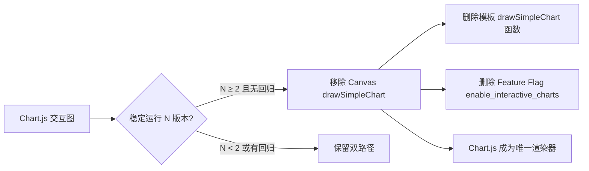

# Chart.js 交互式报告升级 — 风险/收益/架构分析

> **文档版本**：v0.8.7-dev · **分析日期**：2026-07-27
> **关联计划**：[`plan-chartjs-report-upgrade.md`](./plan-chartjs-report-upgrade.md)（实施方案）· [`plan.md`](../managements/plan.md)
> **数据源**：代码审查 + `technical.md` 架构约束 + 模板/渲染管线源码分析

---

## 目录

1. [概述：改造范围与边界](#1-概述改造范围与边界)
2. [收益分析](#2-收益分析)
3. [风险评估](#3-风险评估)
4. [技术债务分析](#4-技术债务分析)
5. [架构约束合规检查](#5-架构约束合规检查)
6. [概要设计决策对齐](#6-概要设计决策对齐)
7. [现有实现详细调研结论](#7-现有实现详细调研结论)
8. [推荐方案与关键决策](#8-推荐方案与关键决策)
9. [附录 A：涉及文件清单](#附录-a涉及文件清单)
10. [附录 B：与 plan-3 / plan-6 的依赖关系](#附录-b与-plan-3--plan-6-的依赖关系)
11. [附录 C：当前实现代码摘要（供实施参考）](#附录-c当前实现代码摘要供实施参考）
12. [附录 D：技术债务清理计划](#附录-d技术债务清理计划）
13. [附录 E：数据依赖矩阵（6 张图 × 数据源）](#附录-e数据依赖矩阵6-张图--数据源）

---

## 1. 概述：改造范围与边界

### 1.1 做什么

将当前 HTML 报告中 6 张使用 Canvas 2D API 原生渲染的静态图表替换为 Chart.js 交互式图表：

| # | 图表 | 当前实现 | 目标 |
|:-:|:-----|:---------|:-----|
| 1 | 资产构成（Doughnut） | 无图表（表格文本） | 环形饼图，点击图例展开明细 |
| 2 | 行业分布（Horizontal Bar） | 无图表（表格文本） | 水平柱状图，排序切换 |
| 3 | 穿透 TOP10（Bar） | 无图表（表格文本） | 柱状图，点击跳转 |
| 4 | 净值趋势（Line） | Canvas `drawSimpleChart` | 折线图，框选缩放+基准对比 |
| 5 | 相关性矩阵（Heatmap） | 无图表（纯文本格子） | Chart.js Matrix 热力图 |
| 6 | 量化指标（Gauge/Radar） | 无图表（表格文本） | 雷达图，与基准对比 |

### 1.2 边界（不做什么）

- **不引入新数据源** — 所有图表数据来自现有 pipeline_data / template context
- **不新增报告模块** — 不修改 `registry.py` `_REPORT_SECTION_DEFAULT`
- **不改变 Excel 管线** — 仅 HTML 端变化
- **不引入后端渲染** — Chart.js 完全客户端侧
- **不替代现有 Canvas 2D** — Feature Flag 控制回退，保留 Canvas 代码路径
- **不解决现有数据隐私问题** — `tojson` 序列化将全量持仓明细嵌入 HTML 文件是现有设计（已有），plan-1 不新增、不恶化、也不改善此状态。分享 HTML 报告即分享全量持仓数据，用户需知情

### 1.3 当前渲染管线现状（基于 v0.8.7-dev 源码分析）

```
orchestrator.py → history_data (dict)
   ↓
html_writer.py → write_html_report(info, history_data, ...)
   ↓  render(context={history_data, section_visible, ...})
report_template.html (1845 行 Jinja2 模板)
   ├── drawSimpleChart()     ← 内联 Canvas 2D，第 265-513 行
   ├── <canvas id="portfolioChart">   ← 净值曲线，第 1448 行
   ├── <canvas id="drawdownChart">    ← 回撤图，第 1560 行
   ├── tojson 序列化数据到内联 <script> 块（4 处）
   └── 其余模块均为表格/文本渲染
```

**关键发现**：当前仅 2 张图使用了 Canvas 2D（净值曲线 + 回撤图），其余 4 张图表区域（资产构成、行业分布、穿透 TOP10、相关性矩阵、量化指标）目前仅有表格文本渲染——它们不是"从 Canvas 迁移到 Chart.js"，而是从零实现 Chart.js 图表。

---

## 2. 收益分析

### 2.1 用户体验收益

| 维度 | 当前状态 | 目标状态 | 收益量化 |
|:-----|:---------|:---------|:---------|
| **数据精确度** | 静态图表仅读取概略趋势 | 悬停显示精确日期/数值 | 每次查看节省 ~10s 回翻 Excel |
| **多维度对比** | 无法交互式筛选/隐藏系列 | 图例点击开关品类显示 | 从"固定视角"到"可探索"质变 |
| **时间范围** | Canvas 渲染全量无缩放 | 框选放大缩小时间区间 | 能聚焦关注时段 |
| **打印兼容** | 打印即所见 | `@media print` + `toBase64Image()` | 打印仍可用 |
| **专业感** | 静态截图级 | 交互仪表盘级 | 可分享给同行顾问 |

### 2.2 工程收益

| 收益 | 说明 |
|:-----|:------|
| **消除自制 Canvas 2D 维护负担** | `drawSimpleChart()` 265 行内联 JS（含 Canvas 原生 DPR 缩放、多数据集、tooltip 等）→ 代之以 Chart.js 成熟库，减少定制 JS 维护量 |
| **一致性** | 6 张图统一使用 Chart.js API 风格、配色体系、交互行为，不再各自为政 |
| **数据分离** | 当前 history_data 既用于 Excel 又用于 HTML Canvas JS 序列化（tojson），Chart.js 迁移后数据结构更明确 |
| **Feature Flag 基础设施** | 为后续"报告模块可配置化"（§1.4.4）积累经验——当前 features.py 仅用于 LLM 模块 |

### 2.3 间接收益（对 plan-3 / plan-6 的支撑）

plan-1 是 plan-3（最大回撤+净值曲线 Chart.js 双轴图增强）和 plan-6（多快照趋势追踪 Chart.js 多线图）的**前提依赖**。plan-1 完成后，plan-3/plan-6 的图表增强仅需适配模板参数，工作量从"从零接入"降为"在已有 Chart.js 框架内扩展"。

---

## 3. 风险评估

### 3.1 风险矩阵

| # | 风险 | 等级 | 概率 | 影响 | 触发条件 | 缓解措施 |
|:-:|:-----|:----|:----:|:----:|:---------|:---------|
| R1 | **HTML 文件体积膨胀** | 中 | 高 | 中 | 6 张图表原始数据内联到 JS → 模板体积 280KB → 预估 ~1MB | ① 服务端预聚合降低数据粒度（如净值曲线按周聚合）② 热力图数据压缩（仅下三角）③ Feature Flag 关闭时回退 Canvas |
| R2 | **国产浏览器兼容性** | 低 | 中 | 低 | 微信内置浏览器/老旧 Chrome 对 ES6+ 或 Chart.js v4 支持不完整 | ① 锁定 Chart.js 版本（不 auto-load latest）② `@babel/standalone` 转译（可选）③ Canvas 回退兜底 |
| R3 | **CDN 可用性风险** | 中 | 低 | 高 | CDN 宕机/被墙导致 Chart.js 无法加载 → 全部交互图表白屏 | ① CDN ↔ 本地 bundle 双策略（features.json 配置 `chart_js_source: "cdn" \| "local"`）② 加载失败自动回退到 Canvas 2D ③ CDN SRI 完整性校验（防劫持） |
| R4 | **Chart.js 热力图插件不成熟** | 中 | 中 | 中 | `chartjs-chart-matrix` 社区插件与 Chart.js v4 版本兼容性未知 | ① 技术选型阶段做 POC 验证 ② 不通过则回退到自制 Canvas 热力图（当前纯文本格子） |
| R5 | **打印降级时序问题** | 中 | 中 | 中 | `chart.toBase64Image()` 异步调用，`window.print()` 触发时快照尚未就绪，打印输出空白或模糊图 | ① `beforeprint` 事件提前预渲染所有 chart 快照到 `` fallback ② `afterprint` 清理临时 img（见 §6.5.4 方案） |
| R6 | **C14 违规风险** | 低 | 低 | **高** | 开发过程中不慎将 chart_data 或 chart_config 写入 `_ENV.globals` | 代码审查重点标注 + 自动化 grep `_ENV.globals\[` 不得出现在非 `html_jinja_env.py` 的文件中 |
| R7 | **JavaScript 调试困难** | 中 | 中 | 中 | Chart.js 数据集配置复杂（特别是热力图 + 雷达图 + 双轴图复合），浏览器调试 vs Python 调试模式切换 | ① 建立 JS 调试辅助页（独立 test HTML）② 模板内 `console.log` 兜底 ③ Python 端预处理器（§8.2.2）减少 JS 复杂度 |
| R8 | **历史走势数据粒度与图表性能** | 中 | 中 | 中 | 净值曲线若含每日数据（~250 点/年 × 品种），Chart.js 渲染性能下降 | ① 服务端下采样（按周/月聚合）② Chart.js `decimation` 插件（内置）③ 数据阈值告警 |
| R9 | **数据隐私泄露** | **中** | 高 | 中 | `tojson` 将全量持仓明细（代码/份额/成本/每日市值）嵌入 HTML 文件内联 `<script>`，分享 HTML 报告 = 分享全量持仓数据。Chart.js 的结构化 JSON 键名规律使批量提取更容易 | ① 在报告中标注"本文件含全量持仓数据，分享前请谨慎" ② `anonymizer` Feature Flag（`features.py` 已存在）开启时对 Chart.js 数据做模糊处理 ③ Chart.js 数据最小化（只传递日期+市值，不含份额/成本） |
| R10 | **CDN 供应链攻击** | 低 | 极低 | **高** | CDN 被投毒或劫持时，恶意 JS 可访问报告中所有数据 | ① 使用 SRI（Subresource Integrity）`integrity="sha384-{{ hash }}" crossorigin="anonymous"` 锁定文件内容 ② 构建步骤生成 hash ③ `onerror` Canvas 回退兜底 |

### 3.2 风险最高项：CDN 可用性（R3）+ 热力图插件（R4）

#### R3 / R10 合并缓解方案：CDN + SRI + onerror

| 方案 | 实现成本 | 用户感知 | 维护成本 |
|:-----|:--------|:---------|:--------|
| **纯 CDN**（cdn.jsdelivr.net/npm/chart.js@4） | 低：1 行 `<script>` | 依赖 CDN 可用 | 低 |
| CDN + 本地 bundle 备选 | 中：feature flag 切换 `chart_js_source` + 本地 chart.min.js | CDN 失败自动降级 | 中：需跟踪 CVE |
| **CDN + SRI + script onerror Canvas 回退**（推荐） | 低：`<script integrity="sha384-..." onerror="fallback()">` | CDN 失败/篡改时所有图变 Canvas | 中：需构建步骤生成 hash |
| 纯本地 bundle | 中：~80KB gzip 嵌入 repo | 无 CDN 依赖 | 中：需手动升级 |

**推荐组合**：CDN + SRI 完整性校验 + `onerror` Canvas 回退（工作量最低，安全有保障）。可选本地 bundle Feature Flag（为离线场景预留）。

SRI hash 生成方式（构建步骤）：
```bash
curl -sL https://cdn.jsdelivr.net/npm/chart.js@4.x/dist/chart.umd.min.js \
  | openssl dgst -sha384 -binary | base64
# 输出填入 <script integrity="sha384-{{ output }}">
```

#### R4 缓解方案

| 场景 | 方案 | 代价 |
|:-----|:------|:------|
| `chartjs-chart-matrix` 兼容 | 使用 Chart.js v4 + 对应 matrix 插件版本 | POC 验证（0.5d） |
| 不兼容 | 回退到 Canvas 2D 自制热力图 | 额外 0.5d，且无交互 |
| 兼容但功能不足 | Chart.js matrix 热力图 + 悬浮相关系数数值 | 可接受方案 |

---

## 4. 技术债务分析

### 4.1 新增技术债务

| # | 债务项 | 性质 | 规模 | 偿还条件 |
|:-:|:-------|:-----|:----|:---------|
| TD1 | **Chart.js 版本锁定** | 依赖锁定 | 1 行 `<script>` src 版本号 + 1 个 SRI hash | Chart.js v5 发布后升级（非强制） |
| TD2 | **CDN 生产依赖** | 外部依赖 | 1 个 `<script>` 标签 | ① 内网环境需 bundle ② 离线场景需本地化 |
| TD3 | **双渲染路径共存** | 代码膨胀 | Canvas `drawSimpleChart()` + Chart.js 渲染器并存 | Feature Flag 稳定后移除 Canvas 路径（见 §4.3） |
| TD4 | **内联 JS 数据膨胀** | 模板体积 | 6 张图 × 序列化数据 = ~700KB 新增 | 数据预聚合/下采样（R8 缓解） |
| TD5 | **测试覆盖缺口** | 测试 | Chart.js 渲染无法用 pytest 测试；双路径 × Feature Flag × 数据状态组合使测试用例翻 2~4 倍 | ① 新增 Python 端数据预处理器单元测试 ② JS 端浏览器截图对比测试（可选） |
| TD6 | **数据隐私风险** | 数据安全 | `tojson` 将全量持仓嵌入 HTML 内联 script | ① 数据最小化传递 ② `anonymizer` 可选匿名 ③ 文档标注风险 |
| TD7 | **双路径测试翻倍** | 测试成本 | Canvas + Chart.js + Feature Flag ON/OFF + 数据正常/降级/不可用 = 至少 3× 测试组合 | 分配额外 0.5d 测试时间（已在 §8.4 纳入） |
| TD8 | **JS 调试设施空白** | 测试基础设施 | 当前项目无 JS 测试/调试工具链 | 建立独立 test HTML 调试页 + Python 预处理器降低 JS 复杂度 |

### 4.2 遗留技术债务（plan-1 不解决，留给后续迭代）

| # | 债务项 | 现状 | 建议偿还时机 |
|:-:|:-------|:-----|:------------|
| TD-L1 | `drawSimpleChart()` 265 行内联 JS | 保留在模板中，仅 Feature Flag 关闭时使用 | plan-1 稳定 2 个版本后移除 |
| TD-L2 | `history_data` 数据同时服务 Excel + HTML Chart.js | 模板 `tojson` 序列化全量数据（含 Excel 不需要的字段） | plan-2/plan-3 可引入 chart_data 专用裁剪 |
| TD-L3 | 模板仍为单文件 1845 行 | Chart.js 迁移后 JS 逻辑增加，模板进一步膨胀 | 配合 plan-1 需做模板拆分评估 |

### 4.3 Feature Flag 稳定后的双路径清理策略



**建议**：标记 `enable_interactive_charts` 稳定后至少保持 2 个发布版本（含回退能力），然后一次性清理 Canvas 路径。清理时统一删除模板中 `drawSimpleChart()` 定义 + Canvas fallback 分支 + Feature Flag 条件判断。

---

## 5. 架构约束合规检查

### 5.1 数据获取层约束

| 约束 | 检查 | 说明 |
|:-----|:-----|:------|
| **C1** 代码类型判定中心化 | ✅ 无关 | Chart.js 图表数据不涉及代码类型判定 |
| **C4** 会话级 API 复用 | ✅ 无关 | 图表数据复用现有 `history_data` / `info` 字典，不新增 HTTP 请求 |
| **C5** HTTP 客户端统一 | ✅ 无关 | Chart.js CDN 加载走浏览器 `<script>`，不经过 Python HTTP 层 |
| **C6** Provider Chain 必经 | ✅ 无关 | 图表所需数据已在编排器阶段通过 `fetch_with_fallback()` 获取 |

### 5.2 缓存层约束

| 约束 | 检查 | 说明 |
|:-----|:-----|:------|
| **C2** 缓存统一管理 | ✅ 无关 | 图表数据复用现有缓存键（无新增缓存类型） |
| **C3** 缓存原子写入 | ✅ 无关 | HTML 文件保存仍走 `html_save.py`，Chart.js 不改变写入流程 |

### 5.3 报告层约束（⚠ 重点区域）

| 约束 | 检查 | 风险等级 | 详细说明 |
|:-----|:-----|:--------:|:---------|
| **C7** 报告序号不可硬编码 | ✅ 安全 | 低 | 不新增报告模块，不改 `_REPORT_SECTION_DEFAULT`，仅增强现有模块内的可视化 |
| **C10** 新闻召回策略可配置 | ✅ 无关 | 低 | 不涉及新闻系统 |
| **C14** 渲染期数据不可写入模块级全局变量 | ⚠ **必须零容忍** | **高** | ① 所有 Chart.js 数据（chart_data、chart_config）必须通过 `render()` context 传递 ② `_ENV.globals` 当前的唯一 `section_visible` 条目（fail-closed 默认）不得新增第二条 ③ 针对 6 张图各自的数据结构，在 `html_writer.py` 中以闭包或 context dict 形式注入 ④ 代码审查时作为**一票否决项** |
| **C19** pipeline_data Schema 契约 | ✅ 安全 | 低 | 若仅对现有 template context 数据做 `tojson` 序列化后 Chart.js 消费（如 `history_data.bars`），则不需要新增 Schema 条目。仅当新增管线级 Chart.js 预处理数据结构（如 `chart_data.portfolio` 新键）时才需注册 |

### 5.4 基础设施约束

| 约束 | 检查 | 说明 |
|:-----|:-----|:------|
| **C8** 日志统一 | ✅ 无关 | Chart.js 是客户端侧，不经过 Python 日志 |
| **C15** 控制台日志着色 | ✅ 无关 | |
| **C16** 路径绝对化 | ⚠ 注意 | 若采用本地 bundle 方案，Chart.js 文件路径必须通过 `PROJECT_ROOT` 推导，不能硬编码或依赖 CWD |

### 5.5 合规总评

```
C1  ✅   C2  ✅   C3  ✅   C4  ✅   C5  ✅   C6  ✅
C7  ✅   C8  ✅   C10 ✅   C14 ⚠→✅   C15 ✅   C16 ⚠→✅
C19 ✅
```

**唯一需要持续关注的约束**：**C14** — 整个改造的核心约束风险点。计划在代码审查中设置自动化检查（grep `_ENV.globals\[` 不得出现在非 `html_jinja_env.py` 的文件中）。

---

## 6. 概要设计决策对齐

### 6.1 §1.4.1 代码类型判定中心化

✅ **不涉及**。图表数据不依赖代码类型判定。

### 6.2 §1.4.2 Provider Chain 必经

✅ **不涉及**。Chart.js 迁移不改变数据获取路径。

### 6.3 §1.4.3 缓存统一管理

✅ **不涉及**。无新增缓存类型。

### 6.4 §1.4.4 报告配置化（⚠ 关键对齐点）

**现有 Feature Flag 基础设施**：

- `features.py` 定义了 28 项 Feature Flag，当前覆盖 LLM 模块 + B 系列 + 历史回撤
- 加载机制：`load_feature_overrides()` → `features.json` → `is_feature_enabled()`
- **现状**：`enable_interactive_charts` 尚未注册到 `_FEATURE_FLAGS_DEFAULT`，仅在 `plan-chartjs-report-upgrade.md` 中提及

**实施建议**：
1. `features.py` `_FEATURE_FLAGS_DEFAULT` 新增 `"enable_interactive_charts": True`（默认开启）
2. `features.json` 可选覆盖（`"enable_interactive_charts": false` → 回退 Canvas 2D）
3. 渲染期通过模板 context 传递标志量：
   ```python
   # html_writer.py write_html_report()
   context = {
       ...,
       "enable_interactive_charts": is_feature_enabled("enable_interactive_charts"),
   }
   ```
4. 模板中条件切换（配合 JS 外部化方案 §8.2.1）：
   ```jinja2
   
     <script src="https://cdn.jsdelivr.net/npm/chart.js@4.x"
             integrity="sha384-{{ chart_js_hash }}"
             crossorigin="anonymous"
             onerror="window.__CHART_CDN_FAILED=true"></script>
     <script src="chart-init.js"></script>
     <canvas id="chart_{{ key }}"></canvas>
   
     {# 保留现有 Canvas 2D / 表格渲染 #}
   
   ```
5. Chart.js 初始化 JS 移出模板为独立文件（`chart-init.js`），模板仅保留 `<canvas>` 容器。数据通过模板 context 传递（C14 合规），不依赖 `_ENV.globals`

### 6.5 §1.4.5 数据降级治理体系

**当前降级状态**：`DegradationTracker` + `DataStatusItem` + `STATUS_MESSAGES` 在 `report/data_status.py` 中管理，`data_status_history` 在模板中渲染。现有体系已经能区分多种降级状态。

**对 Chart.js 图表的影响**——按 `history_data.status` 做三级处理，不简化"有/无"二元：

| `history_data.status` | Chart.js 行为 | 视觉 |
|:----------------------|:-------------|:------|
| `"ok"` | 正常渲染交互图表，全功能（缩放/悬停/筛选） | 实线 + 完整 tooltip |
| `"degraded"` | 渲染图表 + 降级线段以虚线样式标注 + 底部显示 `data_status_history` 明细 | 数据线部分虚线，hover 提示"该时段数据来自降级链路" |
| `"unavailable"` | 不初始化 Chart.js，仅渲染占位文本 | "历史走势数据暂不可用"提示框，与现有降级占位一致 |

**对 4 张从零新建的图表的降级处理**：

| 图表 | 降级条件 | Chart.js 行为 |
|:-----|:---------|:-------------|
| 资产构成 Doughnut | 总持仓为 0 | 占位文本"无持仓数据" |
| 行业分布 Bar | 无行业分类数据（push2 全部失败） | 占位文本"行业数据暂不可用"，复用 `STATUS_MESSAGES.industry_unavailable` |
| 穿透 TOP10 Bar | `penetration` 为 None | 占位文本"穿透分析数据不可用" |
| 量化指标 Radar | 全部 `metrics_*` 指标均为 None | 占位文本"量化指标数据不足"；部分缺失则显示 `N/A` 标签而非 0 |

```python
# 模板内分级渲染示例（简化）

  <canvas id="portfolioChart"></canvas>

  <canvas id="portfolioChart" class="degraded"></canvas>
  <div class="data-status">{{ data_status_history.history_degraded.message }}</div>

  <div class="chart-placeholder">历史走势数据暂不可用</div>

```

所有降级标记复用现有 `data_status_history` 结构，不新增降级类型。`"degraded"` 状态下 Chart.js 渲染数据不变，仅数据集添加 `borderDash: [5, 5]` 样式。

### 6.6 §1.4.4 Feature Flag 与 metrics Flag 的交互

`features.py` 中注册了 7 个 `metrics_*` Feature Flag（`metrics_sharpe`、`metrics_calmar`、`metrics_hhi`、`metrics_winrate`、`metrics_turnover`、`metrics_risk_contribution`、`metrics_beta`），雷达图依赖这些指标数据。

**交互风险**：用户关闭部分指标 Flag 后，雷达图的数据条缺失。若 Chart.js 直接渲染空数据点会导致指标显示为 0（误读为"表现极差"）。

**实施约束**：
1. 雷达图实施时必须检查每项指标的 `is_feature_enabled()` 状态
2. 被关闭的指标在雷达图上显示 `N/A` 标签（不显示为 0）
3. 所有指标均为 `N/A` 时整个雷达图章节降级为占位文本

```python
# 雷达图数据构建示例
radar_metrics = []
if is_feature_enabled("metrics_sharpe"):
    radar_metrics.append({"label": "夏普比率", "value": sharpe_ratio or "N/A"})
if is_feature_enabled("metrics_calmar"):
    radar_metrics.append({"label": "卡玛比率", "value": calmar_ratio or "N/A"})
# ...
```

### 6.7 暗色模式前瞻兼容（对 plan-11 的预留）

**背景**：plan-11（HTML 暗色模式）是 P3 待办项，Chart.js 有内置颜色主题切换能力。

**要求**：plan-1 实施时，所有 Chart.js 颜色配置使用 CSS 变量而非硬编码色值，为 plan-11 预留统一切换入口。

```javascript
// 推荐写法——CSS 变量驱动 Chart.js 颜色
const chartTheme = {
    primary:   getComputedStyle(document.documentElement)
                  .getPropertyValue('--chart-primary').trim() || '#3366CC',
    secondary: getComputedStyle(document.documentElement)
                  .getPropertyValue('--chart-secondary').trim() || '#FF9900',
    danger:    getComputedStyle(document.documentElement)
                  .getPropertyValue('--chart-danger').trim() || '#CC0000',
    grid:      getComputedStyle(document.documentElement)
                  .getPropertyValue('--chart-grid').trim() || '#E0E0E0',
};
```

**收益**：plan-11 实施时只需改 `:root` 中的 CSS 变量即可一键切换暗色主题，不需要重写 Chart.js 配置或修改 JS。若不做此预留，plan-11 需逐个修改 6 张图的 Chart.js dataset 颜色配置。

---

## 7. 现有实现详细调研结论

### 7.1 模板结构关键发现

| 发现 | 影响 |
|:-----|:------|
| 模板为 **单文件 1845 行** Jinja2 模板 | Chart.js 大量内联 `<script>` 将使模板进一步膨胀；建议按需拆分 `<script>` 块或使用外部 `.js` 文件 |
| `drawSimpleChart()` 定义在 **第 265-513 行** | 仅在 `portfolio_history` 或 `drawdown_analysis` 可见时条件加载（`` 块） |
| Canvas 2D 仅支持 2 张图（净值曲线 + 回撤图） | 其余 4 张图（资产构成、行业分布、穿透 TOP10、量化指标）当前为表格文本，**不存在迁移问题**——只需用 Chart.js 新建而非从 Canvas 迁移 |
| `tojson` 过滤器在 **4 处** 出现 | 全部在内联 `<script>` 块中用于序列化 `history_data.bars` + `history_data.benchmarks` |

### 7.2 数据流关键发现

| 阶段 | 文件 | 数据传递方式 |
|:-----|:-----|:-------------|
| 编排器 | `orchestrator.py` | `history_data` dict → 参数传入 `write_html_report()` |
| 写入器 | `html_writer.py` | `history_data` → `render(context={..., history_data=history_data})` |
| 模板 | `report_template.html` | `{{ history_data.bars | tojson }}` → JS 变量 → `drawSimpleChart()` |

**关键**：`history_data` 的 schema 在 `portfolio_history.py` 中定义（`get_combined_timeseries()` 返回值），当前通过 `tojson` 直接序列化到浏览器。这意味着 Chart.js 可直接消费 `history_data.bars` + `history_data.benchmarks`，**不需要新增 pipeline_data 键**（满足 C19 豁免条件）。

### 7.3 当前不存在 Chart.js 相关代码

| 组件 | 状态 |
|:-----|:------|
| `features.py` `enable_interactive_charts` | ❌ 不存在（仅在文档中） |
| `features.json` 中相关字段 | ❌ 不存在 |
| 模板中 Chart.js CDN `<script>` | ❌ 不存在 |
| 模板中 Chart.js 渲染逻辑 | ❌ 不存在 |
| Python 端 Chart.js 数据预处理 | ❌ 不存在 |
| 打印降级 `toBase64Image()` | ❌ 不存在 |

**结论**：plan-1 是从零开始实现 Chart.js 集成，不涉及"迁移"——而是"新增 + 双路径共存"。

---

## 8. 推荐方案与关键决策

### 8.1 技术选型（确认 Chart.js）

| 方案 | 体积 | 热力图 | 缩放 | 打印兼容 | 推荐 |
|:-----|:----:|:-------|:----|:---------|:----|
| **Chart.js** | ~80KB | 需插件 | 内置 | medium | ✅ **推荐** |
| ECharts | ~300KB | 内置 | 内置 | hard | 太重 |
| ApexCharts | ~130KB | 无原生 | 内置 | medium | 缺热力图 |
| 保留 Canvas 2D 自制 | 0KB | 自制 | 无 | low | 放弃（失去交互价值） |

### 8.2 CDN vs 本地 Bundle + SRI

**推荐策略**：CDN + SRI 完整性校验 + `onerror` 自动回退 Canvas 2D + Feature Flag 切换本地 bundle

```
1. 默认: <script src="https://cdn.jsdelivr.net/npm/chart.js@4.x"
            integrity="sha384-{{ chart_js_hash }}"
            crossorigin="anonymous"
            onerror="window.__CHART_CDN_FAILED=true">
   加载失败或完整性校验不通过 → 所有图表回退到 drawSimpleChart() + 表格

2. Feature Flag chart_js_source: "local" 时:
   <script src="{{ static_url }}/chart.min.js">

3. 本地 bundle 来自: data/bundle/chart.min.js + chartjs-plugin-matrix.min.js
   （手动下载，不通过 npm，保持与项目一致的版本控制）
```

SRI hash 由构建步骤生成，chart.js 版本升级时同步更新。

### 8.2.1 设计优化：JS 外部化

**问题**：模板已 1845 行，新增 6 个 Chart.js 初始化脚本（每个 ~30 行 JS + 数据配置）→ 预估 2100+ 行，可维护性下降。

**优化方案**：将 Chart.js 初始化 JS 从模板中分离为独立文件：

```
tmpl/
├── report_template.html     ← 主模板（仅保留 CDN script 标签 + canvas 容器）
├── chart-init.js            ← Chart.js 通用初始化逻辑（6 个图表函数）
└── chart-config.js          ← 图表配色/字体/主题常量化配置（CSS 变量驱动，§6.7）
```

Python 端通过 `html_writer.py` context 传递 JS 文件路径（C14 合规）：
```python
context = {
    ...
    "chart_js_files": ["chart-config.js", "chart-init.js"],
}
```

模板中：
```jinja2

  <script src="{{ js_file }}"></script>

<canvas id="portfolioChart"></canvas>
```

**收益**：
1. 模板维护性提升（不新增 inline JS 膨胀）
2. JS 可独立单元测试（vs 嵌入模板无法测试）
3. 暗色模式（plan-11）只需改 `chart-config.js` 中的 CSS 变量
4. 新增 chart（如 plan-3/plan-6）只需扩展 `chart-init.js`

### 8.2.2 设计优化：Python 端 Chart.js 数据预处理器

**问题**：当前 4 张从零创建的 Chart.js 图表（资产构成、行业分布、穿透 TOP10、量化指标雷达图）所需的数据格式与现有 Python 端渲染函数返回值不完全匹配（详见附录 E）。

**优化方案**：在 `html_writer.py` 或新增 `chart_data_builder.py` 中做数据预处理：

```python
# src/python/report/chart_data_builder.py
def build_chart_datasets(
    history_data: dict | None,
    cat_data: list,
    penetration: dict | None,
    perf_data: list,
    info: dict,
) -> dict:
    """将原始报告数据转换为 Chart.js 数据集格式。

    返回 dict 由模板 context 传递给 chart-init.js 消费（C14 合规）。
    所有 chart 数据集均在 Python 端构建——新增 chart 只需扩展此函数。
    """
    datasets = {}
    if history_data and history_data.get("status") != "unavailable":
        datasets["portfolio_line"] = {
            "labels": [b["date"] for b in history_data["bars"]],
            "datasets": [{
                "label": "组合净值",
                "data": [b["total_value"] for b in history_data["bars"]],
                "borderColor": "var(--chart-primary)",
                "fill": False,
            }],
            "benchmarks": _build_benchmark_datasets(history_data.get("benchmarks", [])),
        }
    # ... 其余 5 张图的 dataset 构建
    return datasets
```

**收益**：
1. 数据转换在 Python 端完成，**可用 pytest 单元测试**
2. 模板 / JS 端只需渲染已格式化数据，显著降低 JS 复杂度
3. chart 数据格式变更时只改 Python 不调 JS，降低耦合
4. 新增 chart（plan-3/plan-6）只需扩展 `build_chart_datasets()` → 新增 `datasets["drawdown_chart"]`

### 8.3 关键决策清单

| 决策 | 选项 | 推荐 | 理由 |
|:-----|:-----|:-----|:------|
| 图表库 | Chart.js / ECharts / ApexCharts | **Chart.js** | 最轻量，够用 |
| CDN 策略 | 纯 CDN / CDN+local / 纯 local / **CDN+SRI+onerror** | **CDN + SRI + onerror** | 零部署成本，CDN 失败/篡改时可降级 |
| JS 组织 | 内联模板 / 外部独立 JS | **外部独立 JS**（chart-init.js + chart-config.js） | 可测试性 + 维护性 + 暗色模式预留 |
| 数据处理 | JS 端 tojson 消费 / Python 端预处理器 | **Python 端预处理器**（chart_data_builder.py） | 可 pytest 测试 + 降低 JS 复杂度 |
| Feature Flag 注册 | features.py / config.json | **features.py** | 与现有 LLM/B 系列标志一致 |
| 热力图方案 | chartjs-chart-matrix / Canvas 2D | **先 POC 验证，确定后选 matrix** | POC 不通过则用 Canvas 自制 |
| 颜色方案 | 硬编码 / CSS 变量 | **CSS 变量** | 为 plan-11 暗色模式预留 |
| 双路径清理 | N 版本后移除 Canvas / 长期共存 | **N=2** | 给用户适应期，积累稳定性 |

### 8.4 工作量重估

基于详细调研 + 自审补充，原 `plan.md` 中 4d 估算**调整如下**：

| 阶段 | 原估算 | 重估 | 调整理由 |
|:-----|:------:|:----:|:---------|
| 技术选型验证 | 0.5d | 0.5d | ✅ 不变（含热力图插件 POC） |
| 数据接口定义 | 0.5d | 0.5d | ✅ 不变（`tojson` 复用） |
| 模板改造 + JS 外部化 | 1d | **1.5d** | ⬆ 新增 chart-init.js / chart-config.js 独立 + SRI 标签 + CDN onerror 回退逻辑 |
| Python 端数据预处理器 | — | **0.5d** | ⬆ 新增 `chart_data_builder.py`，6 张图数据格式转换 + 降级分级处理 |
| 图表迁移/新建 | 1d | **0.75d** | ⬇ 借助 Python 预处理器，JS 端只需消费已格式化数据 |
| 打印降级 | 0.5d | **0.75d** | ⬆ `beforeprint`/`afterprint` 异步时序处理 + 2x 密度 |
| Feature Flag | 0.5d | 0.25d | ⬇ 利用现有 `features.py` 基础设施 |
| 测试（新增） | — | **0.5d** | ⬆ Python 预处理器单元测试 + Feature Flag 开关测试 + 降级分级测试 + 双路径回退测试 |
| **合计** | **4d** | **5.25d** | ⬆ +1.25d |

**净影响**：从原 4d 上调至 **5.25d**（约 5d）。主要增量来自 Python 端数据预处理器（+0.5d）和测试时间（+0.5d），以及 JS 外部化的模板改造增量（+0.5d）和打印降级细化（+0.25d）。

### 8.5 设计优化推荐实施优先级

| 优先级 | 优化项 | 收益 | 工作量 | 建议 |
|:------:|:-------|:-----|:------:|:-----|
| **P0** | Python 端数据预处理器（§8.2.2） | 可测试 + 降低 JS 复杂度 | 0.5d | **必须做**，否则 JS 端数据转换不可测 |
| **P0** | JS 外部化（§8.2.1） | 维护性 + 暗色模式预留 | 0.25d | **必须做**，防止模板膨胀到 2100+ 行 |
| **P1** | CDN SRI（§8.2） | 供应链安全 | 0.1d | **建议做**，成本极低 |
| **P1** | CSS 变量颜色方案（§6.7） | plan-11 兼容 | 0.1d | **建议做**，一次性成本 |
| **P2** | 降级分级渲染（§6.5） | 用户体验精细度 | 已含在预处理中 | 随预处理器自然实现 |
| **P2** | 打印 `beforeprint` 时序（§6.5.4） | 打印可靠性 | 0.15d | 推荐实施 |

**实施建议**：P0 项必须在 plan-1 中实现；P1 项强烈推荐纳入；P2 项可选但已在工作估算中覆盖。

---

## 附录 A：涉及文件清单

| 文件 | 改动类型 | 改动内容 |
|:-----|:---------|:---------|
| `src/python/features.py` | 修改 | `_FEATURE_FLAGS_DEFAULT` 新增 `enable_interactive_charts: True` |
| `src/python/report/html_writer.py` | 修改 | context 传递 `enable_interactive_charts` + `chart_datasets`（Python 预处理器结果） |
| `src/python/report/chart_data_builder.py` | **新建** | Python 端数据预处理器，6 张图数据格式转换 + 降级分级处理 |
| `src/python/report/html_jinja_env.py` | 不改 | C14 约束：不新增 globals |
| `src/python/tmpl/report_template.html` | 修改 | 移除内联 JS（改为 `<script src="chart-init.js">`）+ CDN SRI `<script>` + onerror 回退 + canvas 容器 + 打印降级 |
| `src/python/tmpl/chart-init.js` | **新建** | Chart.js 通用初始化逻辑（6 个图表函数），从模板中分离 |
| `src/python/tmpl/chart-config.js` | **新建** | 图表配色/字体/主题常量化配置（CSS 变量驱动） |
| `src/python/report/html_renderers.py` | 不改 | 保持现有渲染函数返回值不变，向后兼容 |
| `data/config/features.json` | 修改（可选） | 用户覆盖 `enable_interactive_charts` |
| `src/test/test_chart_data_builder.py` | **新建** | 预处理器单元测试 + 降级分级测试 |
| `src/test/` | 新增测试 | ① Feature Flag 开关测试 ② 双路径回退测试 ③ 空状态/降级测试 |

## 附录 B：与 plan-3 / plan-6 的依赖关系

```
plan-1  (交互图表基础框架)
  │
  ├──→ plan-3 (最大回撤+净值曲线 Chart.js 双轴图)
  │     仅需新增 Chart.js 双轴数据集配置 + 模板中第二个 canvas
  │     不涉及 Feature Flag / CDN / 基础设施
  │
  └──→ plan-6 (多快照趋势追踪 Chart.js 多线图)
        仅需新增 trend_data 模板 context + Chart.js 线图配置
        不涉及 Feature Flag / CDN / 基础设施
```

**实施次序**：plan-1 → plan-3 → plan-6，不可并行（均依赖 plan-1 的基础框架）。

---

## 附录 C：当前实现代码摘要（供实施参考）

### C.1 `drawSimpleChart()` 函数签名

```javascript
// report_template.html 第 265 行
function drawSimpleChart(canvasId, datasets, opts) {
    // datasets: [{label, data, color, dashed}]
    // opts: {yFormat: 'index'|'percent'|'currency'}
    // Canvas 2D API 原生渲染，无外部依赖
}
```

### C.2 `history_data` 完整结构

```python
# portfolio_history.py get_combined_timeseries() 返回值
{
    "bars": [{"date": str, "total_value": float, "drawdown": float, "drawdown_pct": float}],
    "benchmarks": [{"code": str, "name": str, "bars": [{"date": str, "value": float}],
                    "total_return_pct": float, "max_drawdown_pct": float}],
    "max_drawdown": float, "max_drawdown_pct": float,
    "drawdown_start": str, "drawdown_end": str,
    "annualized_volatility": float,
    "total_return": float, "total_return_pct": float,
    "status": "ok"|"degraded"|"unavailable",
    "warnings": [str],
}
```

### C.3 `_ENV.globals` 当前唯一条目

```python
# html_jinja_env.py 第 142 行
_ENV.globals["section_visible"] = lambda key: False  # fail-closed 默认值
# 渲染期通过 render(context={"section_visible": actual_fn}) 覆盖
```

### C.4 Feature Flag 加载机制

```python
# features.py 第 34 行
_FEATURE_FLAGS_DEFAULT = {
    "llm_global_macro": True,
    "b_series_fund_manager": True,
    "history_portfolio": True,
    "history_benchmark": True,
    # ... 共 28 项
}

def is_feature_enabled(name: str) -> bool:
    return FEATURE_FLAGS.get(name, _FEATURE_FLAGS_DEFAULT.get(name, False))

def load_feature_overrides() -> None:
    # 从 features.json 读取覆盖值
```

---

## 附录 D：技术债务清理计划

| 检查点 | 清理内容 | 触发条件 |
|:-------|:---------|:---------|
| plan-1 完成后首次提交 | `features.py` 注册 flag + 回退路径测试 | plan-1 实施时 |
| plan-1 稳定 2 版本后 | 移除 `drawSimpleChart()` + Canvas 回退路径 + Feature Flag 条件分支 | 发布 2 个版本后（如 v0.9.0） |
| 本地 bundle 首次启用 | `data/bundle/` 目录 + chart.min.js 下载 + `static_url` 路由 | 用户反馈 CDN 不可达时 |
| 每次 Chart.js 安全更新 | 刷新 CDN 版本号 + 本地 bundle 版本 | CVE 公告 |

---

## 附录 E：数据依赖矩阵（6 张图 × 数据源）

**核心发现**：仅净值曲线（Line）和穿透 TOP10（Bar）的数据源已就绪可直接消费，其余 4 张图需要 Python 端数据预处理（`chart_data_builder.py`）。

| 图表 | 当前数据源 | 数据格式 | 是否就绪 | 预处理需求 |
|:-----|:----------|:---------|:--------:|:-----------|
| **净值趋势** Line | `history_data.bars` + `history_data.benchmarks` | `[{"date","total_value","drawdown"...}]` | ✅ 就绪 | 仅需 `tojson` 序列化 |
| **穿透 TOP10** Bar | `penetration["top10"]` | `list[{"code","name","weight","value"...}]` | ✅ 就绪 | 排序 + 格式化 |
| **资产构成** Doughnut | `cat_counts: dict[str,int]`（品种计数） | `{"股票": 5, "基金": 8, "债券": 2}` | ⚠ 缺市值 | 需要各类资产**市值占比**而非品种计数。`cat_counts` 仅含计数，市值需从 `details` 列表聚合 |
| **行业分布** Bar | `penetration` 含 `sector` 字段（单资产行业） | per-asset sector 归属 | ⚠ 缺行业聚合 | 需要按行业聚合市值（从 `details` + `penetration` 交叉计算），当前无现成函数 |
| **相关性矩阵** Heatmap | 计划 plan-2 新增 `correlation_data` | N×N 下三角矩阵 | ⏳ 依赖 plan-2 | plan-1 仅做热力图框架，数据由 plan-2 提供 |
| **量化指标** Radar | `info` 字典中的 `sharpe`/`calmar`/`volatility` 等 | 分散在 `risk_metrics` 子键 | ⚠ 分散不集中 | 需要统一收集到 `chart_datasets["radar"]`，且需检查 `metrics_*` 7 个 Feature Flag |

**预处理工作分配**：

| 数据准备 | 在哪里做 | 需要哪些输入 |
|:---------|:---------|:------------|
| 净值曲线 dataset | `chart_data_builder.py` | `history_data.bars`, `history_data.benchmarks` |
| 资产构成 dataset | `chart_data_builder.py` | `details` 列表（按 code_type 聚合市值） |
| 行业分布 dataset | `chart_data_builder.py` | `details` + `penetration`（sector 归属） |
| 穿透 TOP10 dataset | `chart_data_builder.py` | `penetration["top10"]` |
| 量化指标 dataset | `chart_data_builder.py` | `info.get("risk_metrics", {})` + `metrics_*` Flag 检查 |
| 相关性矩阵（Heatmap） | 留待 plan-2 | `correlation_data` |

---

> **文档版本记录**
> - 2026-07-27 v1：初版，基于 v0.8.7-dev 代码审查完成
> - 2026-07-27 v2：自审补充 — 新增 R9(隐私)/R10(SRI)/TD6~TD8(债务)、§6.5 三级降级、§6.6(metrics Flag 交互)、§6.7(暗色模式预留)、§8.2.1(JS 外部化)、§8.2.2(Python 预处理器)、§8.5(设计优先级)、附录 E(数据依赖矩阵)；工作量 4d→5.25d
