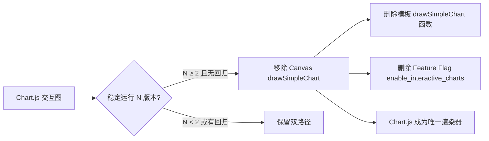

# Chart.js 交互式报告升级 — 风险/收益/架构分析

> **文档版本**：v0.8.7-dev · **分析日期**：2026-07-27
> **关联计划**：[`plan-chartjs-report-upgrade.md`](./plan-chartjs-report-upgrade.md)（实施方案）· [`plan.md`](../managements/plan.md)
> **数据源**：代码审查 + `technical.md` 架构约束 + 模板/渲染管线源码分析

---

## 目录

1. [概述：改造范围与边界](#1-概述改造范围与边界)
2. [收益分析](#2-收益分析)
3. [风险评估](#3-风险评估)
4. [技术债务分析](#4-技术债务分析)
5. [架构约束合规检查](#5-架构约束合规检查)
6. [概要设计决策对齐](#6-概要设计决策对齐)
7. [现有实现详细调研结论](#7-现有实现详细调研结论)
8. [推荐方案与关键决策](#8-推荐方案与关键决策)
9. [附录 A：涉及文件清单](#附录-a涉及文件清单)
10. [附录 B：与 plan-3 / plan-6 的依赖关系](#附录-b与-plan-3--plan-6-的依赖关系)
11. [附录 C：当前实现代码摘要（供实施参考）](#附录-c当前实现代码摘要供实施参考）
12. [附录 D：技术债务清理计划](#附录-d技术债务清理计划）
13. [附录 E：数据依赖矩阵（6 张图 × 数据源）](#附录-e数据依赖矩阵6-张图--数据源）

---

## 1. 概述：改造范围与边界

### 1.1 做什么

将当前 HTML 报告中 6 张使用 Canvas 2D API 原生渲染的静态图表替换为 Chart.js 交互式图表：

| # | 图表 | 当前实现 | 目标 |
|:-:|:-----|:---------|:-----|
| 1 | 资产构成（Doughnut） | 无图表（表格文本） | 环形饼图，点击图例展开明细 |
| 2 | 行业分布（Horizontal Bar） | 无图表（表格文本） | 水平柱状图，排序切换 |
| 3 | 穿透 TOP10（Bar） | 无图表（表格文本） | 柱状图，点击跳转 |
| 4 | 净值趋势（Line） | Canvas `drawSimpleChart` | 折线图，框选缩放+基准对比 |
| 5 | 相关性矩阵（Heatmap） | 无图表（纯文本格子） | Chart.js Matrix 热力图 |
| 6 | 量化指标（Gauge/Radar） | 无图表（表格文本） | 雷达图，与基准对比 |

### 1.2 边界（不做什么）

- **不引入新数据源** — 所有图表数据来自现有 pipeline_data / template context
- **不新增报告模块** — 不修改 `core/registry.py` `_REPORT_SECTION_DEFAULT`
- **不改变 Excel 管线** — 仅 HTML 端变化
- **不引入后端渲染** — Chart.js 完全客户端侧
- **不替代现有 Canvas 2D** — Feature Flag 控制回退，保留 Canvas 代码路径
- **不解决现有数据隐私问题** — `tojson` 序列化将全量持仓明细嵌入 HTML 文件是现有设计（已有），plan-1 不新增、不恶化、也不改善此状态。分享 HTML 报告即分享全量持仓数据，用户需知情

### 1.3 当前渲染管线现状（基于 v0.8.7-dev 源码分析）

```
_report_generation.py → _generate_report_both / _generate_report_full
   │   （write_html_report() 实际调用方，orchestrator 仅为分发入口）
   ↓  history_data (dict) + 各渲染参数
html_writer.py → write_html_report(info, history_data, ...)
   ↓  render(context={history_data, section_visible, ...})
report_template.html (1862 行 Jinja2 模板)
   ├── drawSimpleChart()     ← 内联 Canvas 2D，第 265-513 行
   ├── <canvas id="portfolioChart">   ← 净值曲线，第 1448 行
   ├── <canvas id="drawdownChart">    ← 回撤图，第 1560 行
   ├── tojson 序列化数据到内联 <script> 块（4 处）
   └── 其余模块均为表格/文本渲染
```

**关键发现**：当前仅 2 张图使用了 Canvas 2D（净值曲线 + 回撤图），其余 4 张图表区域（资产构成、行业分布、穿透 TOP10、相关性矩阵、量化指标）目前仅有表格文本渲染——它们不是"从 Canvas 迁移到 Chart.js"，而是从零实现 Chart.js 图表。

---

## 2. 收益分析

### 2.1 用户体验收益

| 维度 | 当前状态 | 目标状态 | 收益量化 |
|:-----|:---------|:---------|:---------|
| **数据精确度** | 静态图表仅读取概略趋势 | 悬停显示精确日期/数值 | 每次查看节省 ~10s 回翻 Excel |
| **多维度对比** | 无法交互式筛选/隐藏系列 | 图例点击开关品类显示 | 从"固定视角"到"可探索"质变 |
| **时间范围** | Canvas 渲染全量无缩放 | 框选放大缩小时间区间 | 能聚焦关注时段 |
| **打印兼容** | 打印即所见 | `@media print` + `toBase64Image()` | 打印仍可用 |
| **专业感** | 静态截图级 | 交互仪表盘级 | 可分享给同行顾问 |

### 2.2 工程收益

| 收益 | 说明 |
|:-----|:------|
| **消除自制 Canvas 2D 维护负担** | `drawSimpleChart()` 265 行内联 JS（含 Canvas 原生 DPR 缩放、多数据集、tooltip 等）→ 代之以 Chart.js 成熟库，减少定制 JS 维护量 |
| **一致性** | 6 张图统一使用 Chart.js API 风格、配色体系、交互行为，不再各自为政 |
| **数据分离** | 当前 history_data 既用于 Excel 又用于 HTML Canvas JS 序列化（tojson），Chart.js 迁移后数据结构更明确 |
| **Feature Flag 基础设施** | 为后续"报告模块可配置化"（§1.4.4）积累经验——`enable_interactive_charts` 作为首个**报告渲染**类开关，与既有 LLM 类（8 个）/基金类（4 个）/新闻类（5 个）/量化类（7 个）Flag 形成完整矩阵（R4 修正：features.py 共 28 个 flag，非"仅用于 LLM"） |

### 2.3 间接收益（对其他计划项的支撑）

plan-1 是 **plan-3**（最大回撤+净值曲线 Chart.js 双轴图增强）和 **plan-6**（多快照趋势追踪 Chart.js 多线图）的**前提依赖**。plan-1 完成后，plan-3/plan-6 的图表增强仅需适配模板参数，工作量从"从零接入"降为"在已有 Chart.js 框架内扩展"。

跨计划交互全景（详见附录 B）：

| 计划项 | 与 plan-1 的关系 | 交互收益 / 配合方式 |
|:-------|:----------------|:--------------------|
| **plan-2**（相关性矩阵） | plan-2 → plan-1（数据配合） | plan-1 的 Heatmap 仅建框架，`correlation_data` 由 plan-2 提供（C19 新键）；plan-2 未完成时降级占位，**不阻塞 plan-1**；plan-2 可与 plan-1 并行 |
| **plan-3**（回撤+净值双轴图） | plan-1 → plan-3（硬依赖） | 双轴图在 plan-1 框架内扩展；非图表部分（回撤检测/恢复时间表/C19 schema）可与 plan-1 并行 |
| **plan-6**（多快照趋势） | plan-1 → plan-6（硬依赖） | 多线图在 plan-1 框架内扩展；聚合既有快照，低风险 |
| **plan-7**（因子暴露分析） | plan-7 ⇢ plan-1（软依赖） | MVP 方案 A（自建轻量柱状渲染 +0.25d）**不阻塞**；plan-1 后排期则方案 B 复用 Chart.js Bar 能力 |
| **plan-11**（HTML 暗色模式） | plan-1 → plan-11（硬依赖） | 依赖 chart-config.js CSS 变量预留（§6.7），极低成本（0.5d） |

### 2.4 ROI 总判断（R4 补充）

| 维度 | 评估 |
|:-----|:-----|
| **投入** | 5.25d（约 1 人周）+ ~45 个测试用例 + 1 个新 Feature Flag |
| **直接收益** | 6 张图从静态 → 交互（悬停精确值/缩放/筛选），报告可读性质变；消除 265 行自制 Canvas JS 维护负担 |
| **杠杆收益** | 解锁 plan-3 / plan-6 的前提依赖；plan-7 软依赖（方案 B 复用 Chart.js Bar）；CSS 变量为 plan-11 暗色模式预留；为"报告模块可配置化"积累 Feature Flag 经验 |
| **风险对冲** | 双路径（Flag 开关可回退）、纯本地 bundle（R21：离线自包含，R3 闭环）、`typeof Chart` 守卫兜底、C14 零容忍 grep |
| **结论** | **值** — 5.25d 换报告从"静态截图"到"交互仪表盘"的质变，且双路径保证可随时回退（Flag OFF 即还原旧渲染），不构成高风险高投入的不可逆改造。**唯一需监控的是实际交付时点**：若 8 迭代中某迭代超支，按 `upgrade.md §5.0 MVP 范围收敛` 的裁剪顺序降档交付（P0 4 张图必保，依次裁 Iter 7 热力图 → Iter 6 雷达降级 → Iter 4 行业分布减配 → Iter 5 穿透分色减配） |

> ⚠ **R4 修正**：§2.2 原"config/features.py 仅用于 LLM 模块"表述错误（实际 28 个 flag，含基金/新闻/量化/功能分类），已修正。

---

## 3. 风险评估

### 3.1 风险矩阵

| # | 风险 | 等级 | 概率 | 影响 | 触发条件 | 缓解措施 |
|:-:|:-----|:----|:----:|:----:|:---------|:---------|
| R1 | **HTML 文件体积膨胀** | 中 | 高 | 中 | 6 张图表原始数据内联到 JS → 模板体积 280KB → 预估 ~1MB | ① 服务端预聚合降低数据粒度（如净值曲线按周聚合）② 热力图数据压缩（仅下三角）③ Feature Flag 关闭时回退 Canvas |
| R2 | **国产浏览器/微信兼容性** | 低 | 中 | 低 | 微信内置浏览器/老旧 Chrome 对 ES6+ 或 Chart.js v4 支持不完整；**R22 澄清**：微信链接访问（X5 内核 Chromium 107+/iOS WKWebView）兼容良好，主要不确定点是 **file:// 方式打开时相对 JS 加载可能被沙箱限制**（需实测，Iter 7 已加验证项） | ① 锁定 Chart.js 版本（不 auto-load latest）② ES5 保守语法（§4.14，替代 @babel/standalone）③ Canvas/表格回退兜底（表格明细永远存在，图表是渐进增强） |
| R3 | **CDN 可用性风险** | 低 | 极低 | 低 | **R21 已闭环**：改用纯本地 bundle（`src/js/chart.min.js` 随报告分发），交互图表不依赖网络，离线/内网照常渲染。残余风险仅剩本地文件损坏（极低，`typeof Chart` 守卫跳过初始化 → Canvas/表格兜底） | ① chart.min.js 随报告复制（离线自包含）② `typeof Chart === 'undefined'` 守卫 → 跳过初始化 → 回退 Canvas 2D / 表格 ③ CDN 方案降级为未来可选增强 |
| R4 | **Chart.js 热力图插件不成熟** | 中 | 中 | 中 | `chartjs-chart-matrix` 社区插件与 Chart.js v4 版本兼容性未知 | ① 技术选型阶段做 POC 验证 ② 不通过则回退到自制 Canvas 热力图（当前纯文本格子） |
| R5 | **打印降级时序问题** | 中 | 中 | 中 | `chart.toBase64Image()` 异步调用，`window.print()` 触发时快照尚未就绪，打印输出空白或模糊图 | ① `beforeprint` 事件提前预渲染所有 chart 快照到 `` fallback ② `afterprint` 清理临时 img（见 §6.5.4 方案） |
| R6 | **C14 违规风险** | 低 | 低 | **高** | 开发过程中不慎将 chart_data 或 chart_config 写入 `_ENV.globals` | 代码审查重点标注 + 自动化 grep `_ENV.globals\[` 不得出现在非 `html_jinja_env.py` 的文件中 |
| R7 | **JavaScript 调试困难** | 中 | 中 | 中 | Chart.js 数据集配置复杂（特别是热力图 + 雷达图 + 双轴图复合），浏览器调试 vs Python 调试模式切换 | ① 建立 JS 调试辅助页（独立 test HTML）② 模板内 `console.log` 兜底 ③ Python 端预处理器（§8.2.2）减少 JS 复杂度 |
| R8 | **历史走势数据粒度与图表性能** | 中 | 中 | 中 | 净值曲线若含每日数据（~250 点/年 × 品种），Chart.js 渲染性能下降 | ① 服务端下采样（按周/月聚合）② Chart.js `decimation` 插件（内置）③ 数据阈值告警 |
| R9 | **数据隐私泄露** | **中** | 高 | 中 | `tojson` 将全量持仓明细（代码/份额/成本/每日市值）嵌入 HTML 文件内联 `<script>`，分享 HTML 报告 = 分享全量持仓数据。Chart.js 的结构化 JSON 键名规律使批量提取更容易 | ① 在报告中标注"本文件含全量持仓数据，分享前请谨慎" ② `anonymizer` Feature Flag（`config/features.py` 已存在）开启时对 Chart.js 数据做模糊处理 ③ Chart.js 数据最小化（只传递日期+市值，不含份额/成本） |
| R10 | **CDN 供应链攻击** | 低 | 极低 | 低 | **R21 已闭环**：无 CDN 加载，引擎来自自身 `src/js/chart.min.js`（可信下载源 + git 跟踪），供应链注入面消失。残余风险仅剩源码仓库被投毒（与依赖注入同源风险，由常规供应链管控覆盖） | ① chart.min.js 从官方/镜像下载一次后入库 git 跟踪 ② 无外部域名加载（浏览器不发起跨域请求）③ 如需额外防护可对该文件计算 SHA-256 并记录在 `src/js/README.md` |
| R11 | **预处理器单图失败导致整报告失败** | 中 | 中 | 高 | `build_chart_datasets()` 对脏数据（如 bars 缺字段、metrics 值非数字）抛异常 → 报告生成整体失败（非单图降级） | ① `build_chart_datasets()` 内部对每个 dataset 独立 try/except，单图失败仅记 warning 并跳过该图，其余图正常 ② 顶层再包一层兜底，任何异常 → 返回空 dict（报告仍有表格/占位）③ 单元测试覆盖脏输入（R6 新增） |
| R12 | **radar 与 history_data 耦合边界** | 低 | 低 | 中 | 外层 `if history_data and status != "unavailable"` 块内构建 radar——当 `history_data` 不可用但 `all_metrics` 有值（历史数据少但指标可算）时，radar 意外丢失 | ① 将 radar 构建移到外层 if 之外，仅依赖 `all_metrics`/`risk_metrics`/`history_data` 三源独立判断 ② 若保持外层 if，需在 Iter 6 验收标准中补充该边界用例（R6 新增） |

### 3.2 风险最高项：引擎加载（R3/R10）+ 热力图插件（R4）

#### R3 / R10 合并缓解方案：纯本地 bundle（R21 决策）

| 方案 | 实现成本 | 用户感知 | 维护成本 |
|:-----|:--------|:---------|:--------|
| **纯 CDN**（cdn.jsdelivr.net/npm/chart.js@4） | 低：1 行 `<script>` | 依赖 CDN 可用，离线白屏 | 低 |
| **CDN + SRI + script onerror Canvas 回退**（旧推荐） | 低：`<script integrity="..." onerror="...">` | CDN 失败/篡改时所有图变 Canvas | 低：SRI hash 需手动重算 |
| **纯本地 bundle**（**R21 采用**） | 低：`src/js/chart.min.js` 随报告复制 + 相对路径 `<script>` | 完全离线自包含，交互不受网络影响 | 低：升级 Chart.js 时替换一个文件 |

**R21 决策**：**纯本地 bundle** —— `chart.min.js`（Chart.js v4 UMD，~200KB）存入 `src/js/`（git 跟踪、随源码分发），`html_writer.py` 渲染后随 `chart-init.js` / `chart-config.js` 一并 `shutil.copy2` 到报告输出目录，模板用相对路径引用。

**理由**：
1. **报告是静态制品** — Chart.js 对报告就像报告里的图片，应内嵌而非外链；外链会失效，外链 JS 同理
2. **个人工具无分发成本** — 唯一使用者是自己，200KB 可忽略
3. **R3 直接闭环** — 交互图表与网络彻底解耦，离线/内网打开照常交互（本项目真实场景：报告可能在无外网环境查看）
4. **R10 随之消除** — 无 CDN 加载即无供应链注入面
5. **实施更简单** — 无 SRI hash 计算、无 onerror 动态加载时序、无 CSP 域名

**防御性兜底**（本地文件损坏等极低概率）：
- `chart-init.js` 每个初始化前 `typeof Chart === 'undefined'` 检测 → 跳过初始化 → 回退 Canvas 2D / 表格

**来源与维护**：
- chart.min.js 从 jsdelivr/npm 下载 `chart.umd.min.js` 一次命名 `chart.min.js` 入库 `src/js/`
- 升级 Chart.js 版本时替换该文件并验证（版本号记录在 `src/js/README.md`）

#### R4 缓解方案

| 场景 | 方案 | 代价 |
|:-----|:------|:------|
| `chartjs-chart-matrix` 兼容 | 使用 Chart.js v4 + 对应 matrix 插件版本 | POC 验证（0.5d） |
| 不兼容 | 回退到 Canvas 2D 自制热力图 | 额外 0.5d，且无交互 |
| 兼容但功能不足 | Chart.js matrix 热力图 + 悬浮相关系数数值 | 可接受方案 |

---

## 4. 技术债务分析

### 4.1 新增技术债务

| # | 债务项 | 性质 | 规模 | 偿还条件 |
|:-:|:-------|:-----|:----|:---------|
| TD1 | **Chart.js 版本锁定** | 依赖锁定 | `src/js/chart.min.js` 固定版本 + 版本号记录于 `src/js/README.md` | Chart.js v5 发布后升级（非强制） |
| TD2 | **报告体积增大** | 静态资源 | `src/js/chart.min.js` ~200KB 随每份报告复制 | 报告自包含的代价；如未来对体积敏感可改 CDN 优先 + 本地兜底（R21 更新：原 CDN 生产依赖已消除） |
| TD3 | **双渲染路径共存** | 代码膨胀 | Canvas `drawSimpleChart()` + Chart.js 渲染器并存 | Feature Flag 稳定后移除 Canvas 路径（见 §4.3） |
| TD4 | **内联 JS 数据膨胀** | 模板体积 | 6 张图 × 序列化数据 = ~700KB 新增 | 数据预聚合/下采样（R8 缓解） |
| TD5 | **测试覆盖缺口** | 测试 | Chart.js 渲染无法用 pytest 测试；双路径 × Feature Flag × 数据状态组合使测试用例翻倍（R5 修正：与 TD7 合并计数，不重复表述） | ① 新增 Python 端数据预处理器单元测试 ② JS 端浏览器截图对比测试（可选） |
| TD6 | **数据隐私风险** | 数据安全 | `tojson` 将全量持仓嵌入 HTML 内联 script | ① 数据最小化传递 ② `anonymizer` 可选匿名 ③ 文档标注风险 |
| TD7 | **双路径测试组合膨胀** | 测试成本 | Canvas + Chart.js + Feature Flag ON/OFF + 数据正常/降级/不可用 = 2×（双路径）× 2（Flag）× 3（数据状态）= 12 种组合（R5 修正：明确组合数，TD5 不再重复计数） | 分配额外 0.5d 测试时间（已在 §8.4 纳入） |
| TD8 | **JS 调试设施空白** | 测试基础设施 | 当前项目无 JS 测试/调试工具链 | 建立独立 test HTML 调试页 + Python 预处理器降低 JS 复杂度 |

### 4.2 遗留技术债务（plan-1 不解决，留给后续迭代）

| # | 债务项 | 现状 | 建议偿还时机 |
|:-:|:-------|:-----|:------------|
| TD-L1 | `drawSimpleChart()` 265 行内联 JS | 保留在模板中，仅 Feature Flag 关闭时使用 | plan-1 稳定 2 个版本后移除 |
| TD-L2 | `history_data` 数据同时服务 Excel + HTML Chart.js | 模板 `tojson` 序列化全量数据（含 Excel 不需要的字段） | plan-2/plan-3 可引入 chart_data 专用裁剪 |
| TD-L3 | 模板仍为单文件 1862 行 | Chart.js 初始化 JS 已外部化（chart-init.js + chart-config.js，§8.2.1），模板仅新增本地 bundle `<script>` + canvas 容器 + Feature Flag 分支，**实际增量有限**（预估 +80~150 行） | plan-1 实施后模板约 1950-2050 行；若需进一步拆分（如章节级 partial），建议纳入 plan-1 之后的独立技术债迭代（R5 更新：JS 外部化已部分缓解模板膨胀） |

### 4.3 Feature Flag 稳定后的双路径清理策略



**建议**：标记 `enable_interactive_charts` 稳定后至少保持 2 个发布版本（含回退能力），然后一次性清理 Canvas 路径。清理时统一删除模板中 `drawSimpleChart()` 定义 + Canvas fallback 分支 + Feature Flag 条件判断。

---

## 5. 架构约束合规检查

### 5.1 数据获取层约束

| 约束 | 检查 | 说明 |
|:-----|:-----|:------|
| **C1** 代码类型判定中心化 | ✅ 无关 | Chart.js 图表数据不涉及代码类型判定 |
| **C4** 会话级 API 复用 | ✅ 无关 | 图表数据复用现有 `history_data` / `info` 字典，不新增 HTTP 请求 |
| **C5** HTTP 客户端统一 | ✅ 无关 | Chart.js 本地 bundle 由浏览器从报告目录加载 `<script src="chart.min.js">`，不经过 Python HTTP 层（R21 更新） |
| **C6** Provider Chain 必经 | ✅ 无关 | 图表所需数据已在编排器阶段通过 `fetch_with_fallback()` 获取 |

### 5.2 缓存层约束

| 约束 | 检查 | 说明 |
|:-----|:-----|:------|
| **C2** 缓存统一管理 | ✅ 无关 | 图表数据复用现有缓存键（无新增缓存类型） |
| **C3** 缓存原子写入 | ✅ 无关 | HTML 文件保存仍走 `html_save.py`，Chart.js 不改变写入流程 |

### 5.3 报告层约束（⚠ 重点区域）

| 约束 | 检查 | 风险等级 | 详细说明 |
|:-----|:-----|:--------:|:---------|
| **C7** 报告序号不可硬编码 | ✅ 安全 | 低 | 不新增报告模块，不改 `_REPORT_SECTION_DEFAULT`，仅增强现有模块内的可视化 |
| **C10** 新闻召回策略可配置 | ✅ 无关 | 低 | 不涉及新闻系统 |
| **C14** 渲染期数据不可写入模块级全局变量 | ⚠ **必须零容忍** | **高** | ① 所有 Chart.js 数据（chart_data、chart_config）必须通过 `render()` context 传递 ② `_ENV.globals` 当前的唯一 `section_visible` 条目（fail-closed 默认）不得新增第二条 ③ 针对 6 张图各自的数据结构，在 `html_writer.py` 中以闭包或 context dict 形式注入 ④ 代码审查时作为**一票否决项** |
| **C19** pipeline_data Schema 契约 | ✅ 安全 | 低 | 若仅对现有 template context 数据做 `tojson` 序列化后 Chart.js 消费（如 `history_data.bars`），则不需要新增 Schema 条目。仅当新增管线级 Chart.js 预处理数据结构（如 `chart_data.portfolio` 新键）时才需注册 |

### 5.4 基础设施约束

| 约束 | 检查 | 说明 |
|:-----|:-----|:------|
| **C8** 日志统一 | ✅ 无关 | Chart.js 是客户端侧，不经过 Python 日志 |
| **C15** 控制台日志着色 | ✅ 无关 | |
| **C16** 路径绝对化 | ✅ 合规 | R21 本地 bundle 方案：`src/js/` 三文件经 `shutil.copy2(PROJECT_ROOT/src/js/*, output_dir)` 复制，`output_dir` 已由 `_absolutize_paths()` 绝对化；模板用相对路径引用，路径安全 |

### 5.5 合规总评

```
C1  ✅   C2  ✅   C3  ✅   C4  ✅   C5  ✅   C6  ✅
C7  ✅   C8  ✅   C9  ✅   C10 ✅   C11 ⚠→✅  C12 ⚠→✅
C13 ✅   C14 ⚠→✅  C15 ✅   C16 ⚠→✅  C17 ✅   C18 ✅
C19 ✅
```

（R3 补充：补齐 C9/C11/C12/C13/C17/C18 六项，实现全部 19 条约束完整覆盖。）
- C9（LLM 模块注册）✅ 无关 — plan-1 不新增 LLM 分析模块
- C11（测试标记）⚠→✅ — 见 §F.3，新增 3 个测试文件全部带 marker
- C12（边缘文件隔离）⚠→✅ — `test_chart_data_builder_edge.py` 独立文件 + edge 标记
- C13（测试敏感路径隔离）✅ 无关 — 预处理器是纯函数，测试不操作文件系统；Feature Flag 测试由 `_auto_reset_feature_flags` fixture 清理
- C17（Multi-LLM Provider Chain）✅ 无关 — plan-1 不新增 LLM API 调用
- C18（credentials_ref 凭据分离）✅ 无关 — plan-1 不新增凭据配置

**唯一需要持续关注的约束**：**C14** — 整个改造的核心约束风险点。计划在代码审查中设置自动化检查（grep `_ENV.globals\[` 不得出现在非 `html_jinja_env.py` 的文件中）。

---

## 6. 概要设计决策对齐

### 6.1 §1.4.1 代码类型判定中心化

✅ **不涉及**。图表数据不依赖代码类型判定。

### 6.2 §1.4.2 Provider Chain 必经

✅ **不涉及**。Chart.js 迁移不改变数据获取路径。

### 6.3 §1.4.3 缓存统一管理

✅ **不涉及**。无新增缓存类型。

### 6.4 §1.4.4 报告配置化（⚠ 关键对齐点）

**现有 Feature Flag 基础设施**：

- `config/features.py` 定义了 28 项 Feature Flag，当前覆盖 LLM 模块 + B 系列 + 历史回撤
- 加载机制：`load_feature_overrides()` → `features.json` → `is_feature_enabled()`
- **现状**：`enable_interactive_charts` 尚未注册到 `_FEATURE_FLAGS_DEFAULT`，仅在 `plan-chartjs-report-upgrade.md` 中提及

**实施建议**：
1. `config/features.py` `_FEATURE_FLAGS_DEFAULT` 新增 `"enable_interactive_charts": True`（默认开启）
2. `features.json` 可选覆盖（`"enable_interactive_charts": false` → 回退 Canvas 2D）
3. 渲染期通过模板 context 传递标志量：
   ```python
   # html_writer.py write_html_report()
   context = {
       ...,
       "enable_interactive_charts": is_feature_enabled("enable_interactive_charts"),
   }
   ```
4. 模板中条件切换（配合 JS 外部化方案 §8.2.1，R21 本地 bundle）：
   ```jinja2
   
     <script src="chart.min.js"></script>   {# src/js/ 本地 bundle，随报告分发 #}
     <script src="chart-init.js"></script>
     <canvas id="chart_{{ key }}"></canvas>
   
     {# 保留现有 Canvas 2D / 表格渲染 #}
   
   ```
5. Chart.js 初始化 JS 移出模板为独立文件（`chart-init.js`），模板仅保留 `<canvas>` 容器。数据通过模板 context 传递（C14 合规），不依赖 `_ENV.globals`

### 6.5 §1.4.5 数据降级治理体系

**当前降级状态**：`DegradationTracker` + `DataStatusItem` + `STATUS_MESSAGES` 在 `report/data_status.py` 中管理，`data_status_history` 在模板中渲染。现有体系已经能区分多种降级状态。

**对 Chart.js 图表的影响**——按 `history_data.status` 做三级处理，不简化"有/无"二元：

| `history_data.status` | Chart.js 行为 | 视觉 |
|:----------------------|:-------------|:------|
| `"ok"` | 正常渲染交互图表，全功能（缩放/悬停/筛选） | 实线 + 完整 tooltip |
| `"degraded"` | 渲染图表 + 降级线段以虚线样式标注 + 底部显示 `data_status_history` 明细 | 数据线部分虚线，hover 提示"该时段数据来自降级链路" |
| `"unavailable"` | 不初始化 Chart.js，仅渲染占位文本 | "历史走势数据暂不可用"提示框，与现有降级占位一致 |

**对 4 张从零新建的图表的降级处理**：

| 图表 | 降级条件 | Chart.js 行为 |
|:-----|:---------|:-------------|
| 资产构成 Doughnut | 总持仓为 0 | 占位文本"无持仓数据" |
| 行业分布 Bar | 无行业分类数据（push2 全部失败） | 占位文本"行业数据暂不可用"，复用 `STATUS_MESSAGES.industry_unavailable` |
| 穿透 TOP10 Bar | `penetration` 为 None | 占位文本"穿透分析数据不可用" |
| 量化指标 Radar | 全部 `metrics_*` 指标均为 None | 占位文本"量化指标数据不足"；部分缺失则显示 `N/A` 标签而非 0 |

```python
# 模板内分级渲染示例（简化）

  <canvas id="portfolioChart"></canvas>

  <canvas id="portfolioChart" class="degraded"></canvas>
  <div class="data-status">{{ data_status_history.history_degraded.message }}</div>

  <div class="chart-placeholder">历史走势数据暂不可用</div>

```

所有降级标记复用现有 `data_status_history` 结构，不新增降级类型。`"degraded"` 状态下 Chart.js 渲染数据不变，仅数据集添加 `borderDash: [5, 5]` 样式。

**DegradationTracker 兼容性确认**：Chart.js 三级降级（ok/degraded/unavailable）基于 `history_data.status`（`portfolio_history.py` 产出），与 `DegradationTracker` 的 T1~T4 数据源降级系统（`report/data_status.py`，追踪各数据源可用性）是正交设计。两者并行运作：DegradationTracker 构建 `data_status_history` 表格展示于报告尾部，Chart.js 读 `history_data.status` 控制图表视觉。无冲突亦无重复（R7 确认）。

### 6.6 §1.4.4 Feature Flag 与 metrics Flag 的交互

`config/features.py` 中注册了 7 个 `metrics_*` Feature Flag（`metrics_sharpe`、`metrics_calmar`、`metrics_hhi`、`metrics_winrate`、`metrics_turnover`、`metrics_risk_contribution`、`metrics_beta`），雷达图依赖这些指标数据。

**交互风险**：用户关闭部分指标 Flag 后，雷达图的数据条缺失。若 Chart.js 直接渲染空数据点会导致指标显示为 0（误读为"表现极差"）。

**实施约束**：
1. 雷达图实施时必须检查每项指标的 `is_feature_enabled()` 状态
2. 被关闭的指标在雷达图上显示 `N/A` 标签（不显示为 0）
3. 所有指标均为 `N/A` 时整个雷达图章节降级为占位文本

```python
# 雷达图数据构建示例
# ⚠ 边界：指标值可能是合法的 0.0（如夏普比率为 0 表示无风险溢价），
#   不能用 `x or "N/A"` 判断空值（0.0 or "N/A" → "N/A"，误判）。
#   须用 `x is None` 判断（或与数据可用性标志配合）。
radar_metrics = []
if is_feature_enabled("metrics_sharpe"):
    radar_metrics.append({"label": "夏普比率", "value": sharpe_ratio if sharpe_ratio is not None else "N/A"})
if is_feature_enabled("metrics_calmar"):
    radar_metrics.append({"label": "卡玛比率", "value": calmar_ratio if calmar_ratio is not None else "N/A"})
# ...
```

### 6.7 暗色模式前瞻兼容（对 plan-11 的预留）

**背景**：plan-11（HTML 暗色模式）是 P3 待办项，Chart.js 有内置颜色主题切换能力。

**要求**：plan-1 实施时，所有 Chart.js 颜色配置使用 CSS 变量而非硬编码色值，为 plan-11 预留统一切换入口。

```javascript
// 推荐写法——CSS 变量驱动 Chart.js 颜色
const chartTheme = {
    primary:   getComputedStyle(document.documentElement)
                  .getPropertyValue('--chart-primary').trim() || '#3366CC',
    secondary: getComputedStyle(document.documentElement)
                  .getPropertyValue('--chart-secondary').trim() || '#FF9900',
    danger:    getComputedStyle(document.documentElement)
                  .getPropertyValue('--chart-danger').trim() || '#CC0000',
    grid:      getComputedStyle(document.documentElement)
                  .getPropertyValue('--chart-grid').trim() || '#E0E0E0',
};
```

**收益**：plan-11 实施时只需改 `:root` 中的 CSS 变量即可一键切换暗色主题，不需要重写 Chart.js 配置或修改 JS。若不做此预留，plan-11 需逐个修改 6 张图的 Chart.js dataset 颜色配置。

---

## 7. 现有实现详细调研结论

### 7.1 模板结构关键发现

| 发现 | 影响 |
|:-----|:------|
| 模板为 **单文件 1862 行** Jinja2 模板 | Chart.js 大量内联 `<script>` 将使模板进一步膨胀；建议按需拆分 `<script>` 块或使用外部 `.js` 文件 |
| `drawSimpleChart()` 定义在 **第 265-513 行** | 仅在 `portfolio_history` 或 `drawdown_analysis` 可见时条件加载（`` 块） |
| Canvas 2D 仅支持 2 张图（净值曲线 + 回撤图） | 其余 4 张图（资产构成、行业分布、穿透 TOP10、量化指标）当前为表格文本，**不存在迁移问题**——只需用 Chart.js 新建而非从 Canvas 迁移 |
| `tojson` 过滤器在 **4 处** 出现 | 全部在内联 `<script>` 块中用于序列化 `history_data.bars` + `history_data.benchmarks` |

### 7.2 数据流关键发现

| 阶段 | 文件 | 数据传递方式 |
|:-----|:-----|:-------------|
| 编排入口 | `orchestrator.py` | 按 `report_type` 分发到 `_generate_report_both`/`_generate_report_full`，**不直接调用 write_html_report()** |
| 报告生成 | `_report_generation.py` | `_generate_report_both`/`_generate_full_html_report` → `write_html_report(history_data, ...)` 参数传入（R1 基线修正：原文档误归 orchestrator） |
| 写入器 | `html_writer.py` | `history_data` → `render(context={..., history_data=history_data})` |
| 模板 | `report_template.html` | `{{ history_data.bars | tojson }}` → JS 变量 → `drawSimpleChart()` |

**关键**：`history_data` 的 schema 在 `portfolio_history.py` 中定义（`get_combined_timeseries()` 返回值），当前通过 `tojson` 直接序列化到浏览器。这意味着 Chart.js 可直接消费 `history_data.bars` + `history_data.benchmarks`，**不需要新增 pipeline_data 键**（满足 C19 豁免条件）。

### 7.3 当前不存在 Chart.js 相关代码

| 组件 | 状态 |
|:-----|:------|
| `config/features.py` `enable_interactive_charts` | ❌ 不存在（仅在文档中） |
| `features.json` 中相关字段 | ❌ 不存在 |
| 模板中 Chart.js CDN `<script>` | ❌ 不存在 |
| 模板中 Chart.js 渲染逻辑 | ❌ 不存在 |
| Python 端 Chart.js 数据预处理 | ❌ 不存在 |
| 打印降级 `toBase64Image()` | ❌ 不存在 |

**结论**：plan-1 是从零开始实现 Chart.js 集成，不涉及"迁移"——而是"新增 + 双路径共存"。

---

## 8. 推荐方案与关键决策

### 8.1 技术选型（确认 Chart.js）

| 方案 | 体积 | 热力图 | 缩放 | 打印兼容 | 推荐 |
|:-----|:----:|:-------|:----|:---------|:----|
| **Chart.js** | ~80KB | 需插件 | 内置 | medium | ✅ **推荐** |
| ECharts | ~300KB | 内置 | 内置 | hard | 太重 |
| ApexCharts | ~130KB | 无原生 | 内置 | medium | 缺热力图 |
| 保留 Canvas 2D 自制 | 0KB | 自制 | 无 | low | 放弃（失去交互价值） |

### 8.2 引擎加载策略：纯本地 bundle（R21 决策）

**R21 决策**：纯本地 bundle —— `chart.min.js`（Chart.js v4 UMD，~200KB）存入 `src/js/`（git 跟踪、随源码分发），渲染时随 `chart-init.js` / `chart-config.js` 一并复制到报告输出目录，模板用相对路径 `<script src="chart.min.js">` 引用。

```
1. src/js/（前端 JS 资产统一目录，随源码分发）
   ├── chart.min.js      ← Chart.js v4 UMD 引擎（从 jsdelivr/npm 下载一次入库）
   ├── chart-config.js   ← 配色/字体/主题常量（CSS 变量驱动）
   ├── chart-init.js     ← 6 个图表初始化函数（含 typeof Chart 守卫）
   └── README.md         ← Chart.js 版本号 + 来源 + 升级说明

2. html_writer.py 渲染后 shutil.copy2 复制到报告输出目录
   模板相对路径引用：<script src="chart.min.js"> + chart-config.js + chart-init.js
   （无 CDN、无 SRI、无 onerror 动态加载）

3. 防御性兜底：chart-init.js 内 typeof Chart === 'undefined' 检测
   → 跳过初始化 → 回退 Canvas 2D / 表格（本地文件损坏等极低概率）
```

**为何放弃 CDN**（R21 复审）：
1. **报告是静态制品** — Chart.js 对报告就像报告里的图片，应内嵌而非外链
2. **个人工具无分发成本** — 200KB 可忽略，且报告自包含是真实需求（离线/内网查看）
3. **CDN 在国内不稳定** — jsdelivr 时快时慢，交互功能不应依赖它
4. **消除供应链面** — 无外部加载即无 R10 注入风险

### 8.2.1 设计优化：JS 外部化

**问题**：模板已 1862 行，新增 6 个 Chart.js 初始化脚本（每个 ~30 行 JS + 数据配置）→ 预估 2100+ 行，可维护性下降。

**优化方案**：将 Chart.js 初始化 JS 从模板中分离为独立文件，统一放 `src/js/`（R21 新建目录）：

```
src/js/
├── chart.min.js         ← 第三方引擎（本地 bundle）
├── chart-init.js        ← Chart.js 通用初始化逻辑（6 个图表函数）
└── chart-config.js      ← 图表配色/字体/主题常量化配置（CSS 变量驱动，§6.7）
```

> `src/python/tmpl/` 仅保留 `report_template.html`（模板职责）；前端 JS 资产独立到 `src/js/`，升级 Chart.js 时仅替换 `chart.min.js`。

Python 端通过 `html_writer.py` context 传递 JS 文件路径（C14 合规）：
```python
context = {
    ...
    "chart_js_files": ["chart-config.js", "chart-init.js"],
}
```

模板中：
```jinja2

  <script src="{{ js_file }}"></script>

<canvas id="portfolioChart"></canvas>
```

**收益**：
1. 模板维护性提升（不新增 inline JS 膨胀）
2. JS 可独立单元测试（vs 嵌入模板无法测试）
3. 暗色模式（plan-11）只需改 `chart-config.js` 中的 CSS 变量
4. 新增 chart（如 plan-3/plan-6）只需扩展 `chart-init.js`

### 8.2.2 设计优化：Python 端 Chart.js 数据预处理器

**问题**：当前 4 张从零创建的 Chart.js 图表（资产构成、行业分布、穿透 TOP10、量化指标雷达图）所需的数据格式与现有 Python 端渲染函数返回值不完全匹配（详见附录 E）。

**优化方案**：在 `html_writer.py` 或新增 `chart_data_builder.py` 中做数据预处理：

```python
# src/python/report/chart_data_builder.py
def build_chart_datasets(
    history_data: dict | None,
    cat_data: list,
    penetration: dict | None,
    perf_data: list,
    info: dict,
) -> dict:
    """将原始报告数据转换为 Chart.js 数据集格式。

    返回 dict 由模板 context 传递给 chart-init.js 消费（C14 合规）。
    所有 chart 数据集均在 Python 端构建——新增 chart 只需扩展此函数。
    """
    datasets = {}
    if history_data and history_data.get("status") != "unavailable":
        datasets["portfolio_line"] = {
            "labels": [b["date"] for b in history_data["bars"]],
            "datasets": [{
                "label": "组合净值",
                "data": [b["total_value"] for b in history_data["bars"]],
                "borderColor": "var(--chart-primary)",
                "fill": False,
            }],
            "benchmarks": _build_benchmark_datasets(history_data.get("benchmarks", [])),
        }
    # ... 其余 5 张图的 dataset 构建
    return datasets
```

**收益**：
1. 数据转换在 Python 端完成，**可用 pytest 单元测试**
2. 模板 / JS 端只需渲染已格式化数据，显著降低 JS 复杂度
3. chart 数据格式变更时只改 Python 不调 JS，降低耦合
4. 新增 chart（plan-3/plan-6）只需扩展 `build_chart_datasets()` → 新增 `datasets["drawdown_chart"]`

### 8.3 关键决策清单

| 决策 | 选项 | 推荐 | 理由 |
|:-----|:-----|:-----|:------|
| 图表库 | Chart.js / ECharts / ApexCharts | **Chart.js** | 最轻量，够用 |
| 引擎加载 | 纯 CDN / CDN+local / CDN+SRI+onerror / **纯本地 bundle** | **纯本地 bundle**（R21） | 离线自包含，R3/R10 闭环，无网络依赖 |
| JS 组织 | 内联模板 / 外部独立 JS | **外部独立 JS**（chart-init.js + chart-config.js） | 可测试性 + 维护性 + 暗色模式预留 |
| 数据处理 | JS 端 tojson 消费 / Python 端预处理器 | **Python 端预处理器**（chart_data_builder.py） | 可 pytest 测试 + 降低 JS 复杂度 |
| Feature Flag 注册 | config/features.py / config.json | **config/features.py** | 与现有 LLM/B 系列标志一致 |
| 热力图方案 | chartjs-chart-matrix / Canvas 2D | **先 POC 验证，确定后选 matrix** | POC 不通过则用 Canvas 自制 |
| 颜色方案 | 硬编码 / CSS 变量 | **CSS 变量** | 为 plan-11 暗色模式预留 |
| 双路径清理 | N 版本后移除 Canvas / 长期共存 | **N=2** | 给用户适应期，积累稳定性 |

### 8.4 工作量重估

基于详细调研 + 自审补充，原 `plan.md` 中 4d 估算**调整如下**：

| 阶段 | 原估算 | 重估 | 调整理由 |
|:-----|:------:|:----:|:---------|
| 技术选型验证 | 0.5d | 0.5d | ✅ 不变（含热力图插件 POC） |
| 数据接口定义 | 0.5d | 0.5d | ✅ 不变（`tojson` 复用） |
| 模板改造 + JS 外部化 | 1d | **1.5d** | ⬆ 新增 src/js/ 目录（chart.min.js 入库）+ chart-init.js / chart-config.js 独立 + 本地 bundle 复制逻辑 + 模板相对路径 script |
| Python 端数据预处理器 | — | **0.5d** | ⬆ 新增 `chart_data_builder.py`，6 张图数据格式转换 + 降级分级处理 |
| 图表迁移/新建 | 1d | **0.75d** | ⬇ 借助 Python 预处理器，JS 端只需消费已格式化数据 |
| 打印降级 | 0.5d | **0.75d** | ⬆ `beforeprint`/`afterprint` 异步时序处理 + 2x 密度 |
| Feature Flag | 0.5d | 0.25d | ⬇ 利用现有 `config/features.py` 基础设施 |
| 测试（新增） | — | **0.5d** | ⬆ Python 预处理器单元测试 + Feature Flag 开关测试 + 降级分级测试 + 双路径回退测试 |
| **合计** | **4d** | **5.25d** | ⬆ +1.25d |

**净影响**：从原 4d 上调至 **5.25d**（约 5d）。主要增量来自 Python 端数据预处理器（+0.5d）和测试时间（+0.5d），以及 JS 外部化的模板改造增量（+0.5d）和打印降级细化（+0.25d）。

### 8.5 设计优化推荐实施优先级

| 优先级 | 优化项 | 收益 | 工作量 | 建议 |
|:------:|:-------|:-----|:------:|:-----|
| **P0** | Python 端数据预处理器（§8.2.2） | 可测试 + 降低 JS 复杂度 | 0.5d | **必须做**，否则 JS 端数据转换不可测 |
| **P0** | JS 外部化（§8.2.1） | 维护性 + 暗色模式预留 | 0.25d | **必须做**，防止模板膨胀到 2100+ 行 |
| **P1** | 本地 bundle 入库（§8.2） | 离线自包含 + 供应链面消除 | 0.1d | **建议做**，下载 chart.min.js 一次入库 src/js/ |
| **P1** | CSS 变量颜色方案（§6.7） | plan-11 兼容 | 0.1d | **建议做**，一次性成本 |
| **P2** | 降级分级渲染（§6.5） | 用户体验精细度 | 已含在预处理中 | 随预处理器自然实现 |
| **P2** | 打印 `beforeprint` 时序（§6.5.4） | 打印可靠性 | 0.15d | 推荐实施 |

**实施建议**：P0 项必须在 plan-1 中实现；P1 项强烈推荐纳入；P2 项可选但已在工作估算中覆盖。

---

## 附录 A：涉及文件清单

| 文件 | 改动类型 | 改动内容 |
|:-----|:---------|:---------|
| `src/python/config/features.py` | 修改 | `_FEATURE_FLAGS_DEFAULT` 新增 `enable_interactive_charts: True` |
| `src/python/report/html_writer.py` | 修改 | context 传递 `enable_interactive_charts` + `chart_datasets`（Python 预处理器结果） |
| `src/python/report/chart_data_builder.py` | **新建** | Python 端数据预处理器，6 张图数据格式转换 + 降级分级处理 |
| `src/python/report/html_jinja_env.py` | 不改 | C14 约束：不新增 globals |
| `src/python/tmpl/report_template.html` | 修改 | 移除内联 JS（改为 `<script src="chart-init.js">`）+ 本地 bundle `<script src="chart.min.js">` + 防御性守卫 + canvas 容器 + 打印降级 |
| `src/js/` | **新建** | 前端 JS 资产统一目录（R21）：`chart.min.js` + `chart-init.js` + `chart-config.js` + `README.md`（版本号记录） |
| `src/js/chart.min.js` | **新建** | Chart.js v4 UMD 引擎（~200KB，git 跟踪，随源码分发） |
| `src/js/chart-init.js` | **新建** | Chart.js 通用初始化逻辑（6 个图表函数），从模板中分离，含 `typeof Chart` 守卫 |
| `src/js/chart-config.js` | **新建** | 图表配色/字体/主题常量化配置（CSS 变量驱动） |
| `src/python/report/html_renderers.py` | 不改 | 保持现有渲染函数返回值不变，向后兼容 |
| `data/config/features.json` | 修改（可选） | 用户覆盖 `enable_interactive_charts` |
| `src/test/test_chart_data_builder.py` | **新建** | 预处理器单元测试 + 降级分级测试 |
| `src/test/` | 新增测试 | ① Feature Flag 开关测试 ② 双路径回退测试 ③ 空状态/降级测试 |

## 附录 B：与其他计划项的依赖关系

### B.1 依赖图总览

```
plan-2 (相关性计算)                    plan-1 (交互图表基础框架)
   │  correlation_data                      │
   │  pipeline_data 新键(C19)                │
   └───────→ Heatmap 数据源                  │
         plan-1 仅建热力图框架               │
         plan-2 未完成 → 降级占位            │
                                             │
   ├──→ plan-3 (最大回撤+净值曲线 Chart.js 双轴图)
   │     仅需新增 Chart.js 双轴数据集配置 + 模板中第二个 canvas
   │     不涉及 Feature Flag / 图表引擎 / 基础设施
   │
   ├──→ plan-6 (多快照趋势追踪 Chart.js 多线图)
   │     仅需新增 trend_data 模板 context + Chart.js 线图配置
   │     不涉及 Feature Flag / 图表引擎 / 基础设施
   │
   └──→ plan-11 (HTML 暗色模式)
         依赖 plan-1 chart-config.js CSS 变量预留（§6.7）
         极低成本（0.5d），局部变量覆盖即可

plan-7 (因子暴露分析)  ⇢  plan-1（软依赖，不阻塞）
   MVP 用方案 A（自建轻量柱状渲染，+0.25d）独立实施；
   若 plan-7 在 plan-1 后排期，用方案 B 直接复用 Chart.js Bar
   （穿透 TOP10 Bar / 行业分布 Horizontal Bar 能力）
```

### B.2 依赖类型分类

| 依赖方向 | 类型 | 说明 |
|:---------|:-----|:-----|
| plan-1 → plan-3 | 硬依赖（单向） | plan-3 的 Chart.js 双轴图需在 plan-1 框架内扩展 |
| plan-1 → plan-6 | 硬依赖（单向） | plan-6 的多线图需在 plan-1 框架内扩展 |
| plan-1 → plan-11 | 硬依赖（单向） | plan-11 暗色模式依赖 chart-config.js CSS 变量预留 |
| plan-2 → plan-1 | 数据配合（反向） | plan-1 的 Heatmap 仅建框架，`correlation_data` 由 plan-2 提供（C19 新键）；plan-2 未完成时降级占位（§1.4.5），不阻塞 plan-1 |
| plan-7 ⇢ plan-1 | 软依赖 | MVP 方案 A 独立实施不阻塞；方案 B 复用 Chart.js Bar 能力（升级交互式风格归属图） |

### B.3 实施次序

- **推荐次序（plan.md ②③④⑤⑦）**：plan-7 → plan-2/plan-3（分析基础）→ **plan-1** → plan-6 → plan-11。
- plan-1 是 plan-3/plan-6/plan-11 的**前提依赖**；但 plan-3 的**非图表部分**（回撤事件检测、恢复时间明细表、C19 schema、§1.4.5 降级）**不依赖 plan-1，可与 plan-1 并行**，仅「Chart.js 双轴图适配」需在 plan-1 之后。
- plan-2 **完全可与 plan-1 并行**；若 plan-2 先完成，plan-1 的 Iter 7 热力图可直接用真实 `correlation_data`，否则降级占位显示「等待 plan-2 数据」。
- plan-7 **不阻塞在 plan-1**（软依赖，MVP 方案 A 自建柱状渲染）。

---

## 附录 C：当前实现代码摘要（供实施参考）

### C.1 `drawSimpleChart()` 函数签名

```javascript
// report_template.html 第 265 行
function drawSimpleChart(canvasId, datasets, opts) {
    // datasets: [{label, data, color, dashed}]
    // opts: {yFormat: 'index'|'percent'|'currency'}
    // Canvas 2D API 原生渲染，无外部依赖
}
```

### C.2 `history_data` 完整结构

```python
# portfolio_history.py get_combined_timeseries() 返回值
{
    "bars": [{"date": str, "total_value": float, "drawdown": float, "drawdown_pct": float}],
    "benchmarks": [{"code": str, "name": str, "bars": [{"date": str, "value": float}],
                    "total_return_pct": float, "max_drawdown_pct": float}],
    "max_drawdown": float, "max_drawdown_pct": float,
    "drawdown_start": str, "drawdown_end": str,
    "annualized_volatility": float,
    "total_return": float, "total_return_pct": float,
    "status": "ok"|"degraded"|"unavailable",
    "warnings": [str],
}
```

### C.3 `_ENV.globals` 当前唯一条目

```python
# html_jinja_env.py 第 142 行
_ENV.globals["section_visible"] = lambda key: False  # fail-closed 默认值
# 渲染期通过 render(context={"section_visible": actual_fn}) 覆盖
```

### C.4 Feature Flag 加载机制

```python
# config/features.py 第 34 行
_FEATURE_FLAGS_DEFAULT = {
    "llm_global_macro": True,
    "b_series_fund_manager": True,
    "history_portfolio": True,
    "history_benchmark": True,
    # ... 共 28 项
}

def is_feature_enabled(name: str) -> bool:
    return FEATURE_FLAGS.get(name, _FEATURE_FLAGS_DEFAULT.get(name, False))

def load_feature_overrides() -> None:
    # 从 features.json 读取覆盖值
```

---

## 附录 D：技术债务清理计划

| 检查点 | 清理内容 | 触发条件 |
|:-------|:---------|:---------|
| plan-1 完成后首次提交 | `config/features.py` 注册 flag + 回退路径测试 | plan-1 实施时 |
| plan-1 稳定 2 版本后 | 移除 `drawSimpleChart()` + Canvas 回退路径 + Feature Flag 条件分支 | 发布 2 个版本后（如 v0.9.0） |
| 每次 Chart.js 安全更新 | 替换 `src/js/chart.min.js` 为新版本并验证（版本号同步更新于 `src/js/README.md`） | CVE 公告 |

---

## 附录 E：数据依赖矩阵（6 张图 × 数据源）

**核心发现**：仅净值曲线（Line）和穿透 TOP10（Bar）的数据源已就绪可直接消费，其余 4 张图需要 Python 端数据预处理（`chart_data_builder.py`）。

| 图表 | 当前数据源 | 数据格式 | 是否就绪 | 预处理需求 |
|:-----|:----------|:---------|:--------:|:-----------|
| **净值趋势** Line | `history_data.bars` + `history_data.benchmarks` | `[{"date","total_value","drawdown"...}]` | ✅ 就绪 | 仅需 `tojson` 序列化 |
| **穿透 TOP10** Bar | `penetration["top10"]` | `list[{"code","name","weight","value"...}]` | ✅ 就绪 | 排序 + 格式化 |
| **资产构成** Doughnut | `cat_counts: dict[str,int]`（品种计数） | `{"股票": 5, "基金": 8, "债券": 2}` | ⚠ 缺市值 | 需要各类资产**市值占比**而非品种计数。`cat_counts` 仅含计数，市值需从 `details` 列表聚合 |
| **行业分布** Bar | `penetration` 含 `sector` 字段（单资产行业） | per-asset sector 归属 | ⚠ 缺行业聚合 | 需要按行业聚合市值（从 `details` + `penetration` 交叉计算），当前无现成函数。sector 来自 `classify_sector(name, code)` 关键词映射（`data/knowledge/sector_keywords.json`）或行业 API `sector_api`，无归属品种归入"其他" |
| **相关性矩阵** Heatmap | 计划 plan-2 新增 `correlation_data` | N×N 下三角矩阵 | ⏳ 依赖 plan-2 | plan-1 仅做热力图框架，数据由 plan-2 提供 |
| **量化指标** Radar | `info` 字典中的 `sharpe`/`calmar`/`volatility` 等 | 分散在 `risk_metrics` 子键 | ⚠ 分散不集中 | 需要统一收集到 `chart_datasets["radar"]`，且需检查 `metrics_*` 7 个 Feature Flag |

**预处理工作分配**：

| 数据准备 | 在哪里做 | 需要哪些输入 |
|:---------|:---------|:------------|
| 净值曲线 dataset | `chart_data_builder.py` | `history_data.bars`, `history_data.benchmarks` |
| 资产构成 dataset | `chart_data_builder.py` | `details` 列表（按 `property` 资产属性聚合市值，键集：股票/基金/债券/现金/其他，复用 `_categorize_holding`） |
| 行业分布 dataset | `chart_data_builder.py` | `details` + `penetration`（sector 归属） |
| 穿透 TOP10 dataset | `chart_data_builder.py` | `penetration["top10"]` |
| 量化指标 dataset | `chart_data_builder.py` | `info.get("risk_metrics", {})` + `metrics_*` Flag 检查 |
| 相关性矩阵（Heatmap） | 留待 plan-2 | `correlation_data` |

---

## 附录 F：第 2 轮架构深度审计（与 technical.md 逐条对照）

### 审计结果

| 约束 | 状态 | 详细说明 |
|:-----|:----|:---------|
| **C1** 代码类型判定 | ✅ 无关 | Chart.js 图表不涉及代码类型判定 |
| **C2** 缓存统一 | ✅ 无关 | 无新增缓存类型 |
| **C3** 缓存原子写入 | ✅ 无关 | HTML 写入仍走 `html_save.py` |
| **C4** 会话级 API 复用 | ✅ 无关 | `chart_data_builder.py` 是纯计算函数，无 HTTP 请求 |
| **C5** HTTP 客户端统一 | ✅ 无关 | Chart.js 本地 bundle 由浏览器从报告目录加载 `<script src="chart.min.js">`，不经过 Python HTTP 层（R21 更新） |
| **C6** Provider Chain 必经 | ✅ 无关 | 图表所需数据已在编排器阶段获取 |
| **C7** 报告序号可配置 | ✅ 安全 | 不改 `_REPORT_SECTION_DEFAULT`，不新增模块 |
| **C8** 日志统一 | ✅ 无关 | 客户端 JS 不经过 Python 日志 |
| **C9** LLM 模块注册 | ✅ 无关 | plan-1 不新增 LLM 分析模块（R3 补齐，原表遗漏） |
| **C10** 新闻召回可配置 | ✅ 无关 | 不涉及新闻系统 |
| **C14** 渲染期数据不可写 `_ENV.globals` | ✅ 深度合规 | 见下方 §F.2 |
| **C15** 日志着色 | ✅ 无关 | |
| **C16** 路径绝对化 | ✅ 合规 | R21 本地 bundle 方案：`src/js/` 三文件经 `shutil.copy2(src, os.path.join(output_dir, fname))` 复制，`output_dir` 在 `get_config()` 时已由 `_absolutize_paths()` 绝对化（`config/_core.py`），模板用相对路径引用，路径安全 |
| **C17** Multi-LLM Provider Chain | ✅ 无关 | plan-1 不新增 LLM API 调用（R3 补齐，原表遗漏） |
| **C18** credentials_ref 凭据分离 | ✅ 无关 | plan-1 不新增凭据配置（R3 补齐，原表遗漏） |
| **C19** pipeline_data Schema | ✅ 安全 | `chart_datasets` 不经过 pipeline_data，仅 template context。注：radar 数据间接派生自 `pipeline_data["risk_metrics"]`（`_prepare_full_risk_metrics` 注入，`_report_generation.py:165/167`），但 `risk_metrics` 键已在 Schema 定义，无需新增键（R3 补充依据） |
| **C11** 测试标记 | ⚠ 需要关注 | 见下方 §F.3 |
| **C12** 边缘文件隔离 | ⚠ 需要关注 | 见下方 §F.3 |
| **C13** 测试敏感路径隔离 | ✅ 无关 | 纯函数测试不操作文件系统 |

### F.2 C14 深度分析：`section_visible` globals 模式

当前 `_ENV.globals["section_visible"]` 仅作为 fail-closed 默认值（`lambda key: False`），渲染期被 context 传递的 `_sv_fn` 闭包覆盖。

**`section_visible_dict` 传递路径**（v0.8.7-dev 已验证）：

```
html_writer.py: _compute_section_visibility()
    → section_visible_dict (dict)
    → _sv_fn = lambda key, _d=section_visible_dict: bool(...)
    → render(context={
          section_visible_dict=section_visible_dict,  # 模板备用
          section_visible=_sv_fn,                      # 实际使用（覆盖 globals）
      })
```

**重要发现**：`html_jinja_env.py` 的 `_jinja_section_visible()` 函数（第 113-127 行）定义了但**从未注册**到 `_ENV.globals`——它是死代码。实际的 globals 条目只有第 142 行的 `lambda key: False`。这说明 C14 已经严格执行多年，plan-1 沿用此模式即可。

**对 plan-1 的要求**：
- `chart_datasets` → 通过 render() context 传递（与 `section_visible_dict` 同级）
- `enable_interactive_charts` → 通过 render() context 传递
- 不在 `_ENV.globals` 增加任何新条目
- code review grep 规则：`grep '_ENV\.globals\[' | grep -v html_jinja_env.py` → 0 结果

### F.3 C11/C12 测试标记与边缘文件隔离

| 测试文件 | 内容 | 标记 | 边缘隔离 |
|:---------|:-----|:-----|:---------|
| `test_chart_data_builder.py` | 预处理器单元测试（正常输入） | `unit` + `unit_report` | 不隔离 |
| `test_chart_data_builder_edge.py` | 边缘场景（空/全降级/全N/A） | `unit` + `unit_report` + **`edge`** | **必须 `*_edge.py`** |
| `test_feature_interactive.py` | Feature Flag 开关测试 | `unit` + `unit_config` | 不隔离 |
| `test_pipeline_smoke.py`（增强） | 全流程集成测试 | `scenario_basic` | 不隔离 |

**关键约束**：带 `@pytest.mark.edge` 的测试文件必须命名为 `*_edge.py`，反之 `*_edge.py` 中的测试必须带 edge 标记。conftest.py 的 `pytest_collection_modifyitems` 会在收集期校验。

**⚠ 门禁覆盖缺口（R9 确认）**：`test_runner.py` 的 dev-verify（P0）核心模块 marker 为 `unit_core|unit_providers|unit_fetcher|unit_analysis`、verify（P1）为 `unit_core|unit_providers|unit_fetcher|unit_config|unit_news|unit_llm|unit_analysis`，**均不含 `unit_report`**（现有 47 个报告测试文件标 `unit_report`，整体纳入会显著拖慢门禁）。因此 `test_chart_data_builder.py`（核心预处理器回归守护）默认**不进 P0/P1 门禁**，仅 `--mode report` / `--mode all` 覆盖。

**缓解措施**：
1. **迭代 8 P0 门禁命令扩展为 `python scripts/test_runner.py --mode dev-verify,report`**（dev-verify 守护核心模块 + report 守护报告/图表预处理器）
2. **P1 合入 master 前**额外跑 `python scripts/test_runner.py --mode report`（verify + report 双覆盖）
3. `test_feature_interactive.py`（`unit_config`）已在 P1 verify 门禁内 ✅；`test_pipeline_smoke.py`（`scenario_basic`）已由 P0 dev-verify 场景阶段与 P2 regression 覆盖 ✅
4. 不将 `unit_report` 整体并入 dev-verify/verify——现有 47 个报告测试文件会让提交门禁超时（4 分钟内难完成）
5. **LLM mock 强制**：`test_pipeline_smoke.py` 等触发 `generate_all_llm()`/`call_llm()` 的测试必须 `unittest.mock.patch`/`monkeypatch` mock LLM（遵循 CLAUDE.md）；`chart_data_builder` 纯函数测试本身不涉及 LLM，无需 mock
6. **输出目录隔离**：触发 `write_html_report()` 的集成测试（如 `test_pipeline_smoke.py`）必须将 `output_dir`/`reports/` 重定向到 `tmp_path`（遵循 CLAUDE.md）；`test_html_report_structure.py` 通过 `_build_minimal_render_data()` 新增 `chart_datasets={}` + `enable_interactive_charts=False` 安全默认值规避渲染副作用

### F.4 隐藏问题清单

| # | 问题 | 等级 | 说明 |
|:-:|:-----|:----|:------|
| H1 | `config/features.py` 分类注释计数不同步 | 低 | `# ── 功能特性（2 项）──` → 注册后应为 **3 项** |
| H2 | `data_unavailable` 与 chart 的交互未覆盖 | 低 | `data_unavailable=True` 时（持仓有成本但总市值=0），Chart.js 应显示"暂无数据"横幅而非尝试渲染空图。**已修复** — Iter 3（§5 验收标准 4）和 Iter 6（§5 验收标准 6）均已添加 `data_unavailable` 交叉验证 |
| H3 | 模板 context 膨胀未评估 | 低 | 当前 render() 已传递约 **40 个 context 变量**。`chart_datasets` 是多个 JSON 数据集构成的嵌套 dict，加入后 context 序列化/传递性能需验证（预估 <5ms 增量） |
| H4 | 量化指标雷达图数据来源核查已确认 | 中 | `prep["risk_metrics"]` 仅含 5 个基本字段（volatility/max_drawdown/return 等）。全量 14 项指标（sharpe/calmar/HHI/beta 等）由 `compute_all_metrics()` 计算后存于局部变量 `_metrics`，**仅传入 LLM（`_report_generation.py:547` `metrics=_metrics`），从未传入 `write_html_report()`**。Iter 1 需在 `_report_generation.py::_generate_full_html_report` 中将 `_metrics` 合并到 `chart_datasets` 或在 `build_chart_datasets()` 新增参数 `all_metrics` 接收（R1 基线修正：原文档"编排器"与"第 948 行"不准确） |
| H5 | Feature Flag 读取位置选择 | 低 | `enable_interactive_charts` 是在 `html_writer.py` 内部读（如 debate flag），还是由 caller 传参？当前 debate flag 在内部读，建议一致。**已修复** — 经代码审查确认：`enable_b_series/enable_news/enable_history/enable_llm` 全部从 config 读取后以参数形式传入 `write_html_report()`，debate flag 的 `html_writer` 内读是特例（late-binding 需求）。统一采用参数传递模式：`_report_generation.py`（`_generate_report_both`）读 `is_feature_enabled("enable_interactive_charts")` → 传入 `write_html_report()`。实际代码中 `is_enable_b_series(config)` 等在 `_report_generation.py::_generate_report_both` 内读取（非 orchestrator），R1 基线修正后读取位置明确归 `_report_generation.py`（R7 + R1 确认） |
| H6 | Both 路径雷达图数据源缺口 | 低 | both 路径不计算 `prep["risk_metrics"]`（中段代码无 `_risk` 注入），也不计算 `_metrics`。雷达图若无兜底将完全为空。**已修复** — `_build_radar_dataset()` 新增第三级降级：当 `all_metrics=None` 且 `risk_metrics=None` 时，从 `history_data` 提取 `annualized_volatility`/`max_drawdown_pct`/`total_return_pct` 3 个基本轴。`history_data` 双路径均有，此降级确保 both 路径也能显示基础雷达图（R7 确认） |


> **文档版本记录**
> - 2026-07-27 v1：初版，基于 v0.8.7-dev 代码审查完成
> - 2026-07-27 v2：自审补充 — 新增 R9(隐私)/R10(SRI)/TD6~TD8(债务)、§6.5 三级降级、§6.6(metrics Flag 交互)、§6.7(暗色模式预留)、§8.2.1(JS 外部化)、§8.2.2(Python 预处理器)、§8.5(设计优先级)、附录 E(数据依赖矩阵)；工作量 4d→5.25d
> - 2026-07-27 v3：**第 2 轮架构深度审计** — 逐条对照 technical.md 全部 19 条约束 + 5 项核心决策；发现 5 项隐藏问题（H1~H5）；新增测试标记与边缘隔离规范（§F.3）；C14 深度分析确认 `section_visible` globals 模式安全可复用（§F.2）
> - 2026-07-27 v4（R4+R5）：CDN 策略简化 — SRI hash 硬编码（非构建步骤）、本地 bundle 降级 P2、§F.3 命名修复、两文档 CDN 策略描述全局同步
>   - H4 确认升级：`_metrics`（14 项全量）从未传入 `write_html_report()`，Iter 1 需新增 `all_metrics` 预处理器参数
> - 2026-07-27 v5（R6）：实施细节补全 — JS 文件交付机制（`shutil.copy2`）、chart-init.js CDN 失败守卫 + canvas 存在检测、`Chart.instances.forEach` 修正（非标准 API）、Both 路径雷达图差异标记
> - 2026-07-27 v6（R7）：Feature Flag 读取位置确认（orchestrator 参数传递模式 ↑ 与 enable_* 系列一致）、DegradationTracker 兼容性确认（正交无冲突）、H5/H6 修复、Both 路径雷达图 `history_data` 三级降级兜底
> - 2026-08-01 v7（R1）：基线复盘修正 — 模板行数 1845→1862（5 处同步）；`write_html_report()` 实际调用方为 `_report_generation.py`（orchestrator 仅分发入口，§1.3/§7.2 管线图修正）；H4 `_metrics` 传给 LLM 位置 948→547；H5 读取位置明确归 `_report_generation.py`（与 `is_enable_b_series(config)` 既有位置一致）
> - 2026-08-01 v8（R2）：数据链路复盘 — 资产构成聚合键 `code_type`→`property`（附录 E 数据依赖矩阵）；行业分布聚合键明确 penetration `sector`（`classify_sector`/`sector_api`，无归属归"其他"）；§6.6 雷达图空值判断 `x or "N/A"`→`x is not None`（0.0 合法值不误判）；upgrade.md 新增 R2 数据契约明细
> - 2026-08-01 v9（R3）：架构约束核对 — §5.5 合规总评补齐 C9/C11/C12/C13/C17/C18 六项实现 19 条全覆盖；附录 F 表补齐 C9/C17/C18 三行（原表遗漏）；C16 补充 `output_dir` 已绝对化依据；C19 补充 `risk_metrics` 键已在 Schema 定义的间接派生说明
> - 2026-08-01 v10（R4）：收益验证 — §2.2 修正"config/features.py 仅用于 LLM"错误（实际 28 个 flag）；新增 §2.4 ROI 总判断（投入 5.25d vs 质变收益 + 双路径回退 + 超支裁剪方案）
> - 2026-08-01 v11（R5）：技术债与降级体系 — TD5/TD7 测试组合数合并修正（2~4 倍 → 明确 12 种组合，TD5 不再重复计数）；TD-L3 更新为 JS 外部化已部分缓解模板膨胀（预估 1950-2050 行）；确认三级降级与 DegradationTracker 正交
> - 2026-08-01 v12（R6）：风险清单深化 — 新增 R11（预处理器单图异常隔离，独立 try/except + 顶层兜底）、R12（radar 与 history_data 耦合边界，radar 独立构建）；确认 Jinja2 3.1.6 `tojson` 自动转义 `<`/`>`（XSS 安全，R9 不升级）
> - 2026-08-01 v13（R7）：与其他计划项交互 — 附录 B 重写为完整依赖图（B.1 总览 / B.2 依赖类型分类表 / B.3 实施次序）；补全 4 处遗漏：① plan-2→plan-1 Heatmap 数据配合（`correlation_data`，C19 新键，未完成降级占位不阻塞）② plan-7⇢plan-1 软依赖（方案 A 独立 / 方案 B 复用 Chart.js Bar）③ plan-11→plan-1 CSS 变量预留依赖 ④ 修正「plan-1→plan-3→plan-6 不可并行」为与 plan.md 推荐次序（plan-7→plan-2/3→plan-1→plan-6→plan-11）一致，plan-2 可与 plan-1 并行、plan-3 非图表部分可并行；§2.3 间接收益扩为跨计划交互表；§2.4 杠杆收益补 plan-7
> - 2026-08-01 v14（R8）：MVP 范围收敛 — 新增图表优先级矩阵（P0 净值/回撤/资产构成/穿透 TOP10，P1 行业分布/量化雷达，P2 热力图框架）与超支裁剪顺序（Iter 7 跳过 → Iter 6 雷达降 3 轴 → Iter 4 行业分布减配单排序 → Iter 5 穿透减配单色）及三档交付判定标准；§2.4 ROI 结论引用 `upgrade.md §5.0`；upgrade.md 同步 v11
> - 2026-08-01 v15（R9）：测试与门禁 — 确认门禁覆盖缺口：`test_chart_data_builder.py`（`unit_report`）不在 P0 dev-verify / P1 verify 门禁内（47 个报告测试文件整体并入会超时）；缓解措施：P0 门禁扩展为 `--mode dev-verify,report`、P1 合入前补跑 `--mode report`；F.3 补充 LLM mock 强制与输出目录隔离要求；upgrade.md 迭代 8 门禁命令同步 v12
> - 2026-08-01 v16（R10）：可访问性与体验 — 原计划可访问性零覆盖；新增 upgrade.md §4.8 六项要求（A1 canvas fallback + aria-label/role、A2 对比度 WCAG AA、A3 色盲安全 palette、A4 移动端响应式、A5 CDN 失败表格兜底、A6 键盘可达性记技术债不做 MVP）；Iter 1 模板任务 + Iter 7 手动验证补 A1/A4；upgrade.md 同步 v13
> - 2026-08-01 v17（R11）：性能优化 — R1（文件体积）/R8（数据粒度）/TD4 已识别风险但「下采样」未落成决策；新增 upgrade.md §4.9（P1 服务端下采样：bars>500 周聚合、周后>200 月聚合兜底，仅作用于 Chart.js 数据集不改原始 bars；P2 动画关闭；P3 CDN defer）；Iter 2 验收 + 迭代总览测试计数 ~41→~45 同步；upgrade.md v14
> - 2026-08-01 v18（R12）：安全审查 — tojson 转义（R6）/SRI（R10）/隐私（R9）已覆盖；补 JS 端约束：新增 upgrade.md §4.10（S1 禁止 innerHTML 渲染图表 label——行业名来源含 API 可注入、S2 SRI hash 版本升级须重算否则静默降级、S3 tojson 转义确认、S4 数据最小化、S5 CSP 可选）；Iter 1 chart-init.js 任务补 S1；upgrade.md v15
> - 2026-08-01 v19（R13）：代码组织与可维护性 — JS 端缺单图异常隔离（对称 R11）与键名契约；新增 upgrade.md §4.11（O1 JS 端独立 try/catch、O2 dataset 键名契约 6 固定键、O3 降级标记契约 degraded 字段、O4 文件行数预算、O5 命名规范）；Iter 1 补 O1/O2；upgrade.md v16
> - 2026-08-01 v20（R14）：数据 schema 契约 — R2 契约表覆盖输入字段但输出结构未固化；新增 upgrade.md §4.12（通用 labels/datasets/degraded 结构 + 6 图差异 + 空值语义三态：键缺失占位/空数组无数据/degraded 虚线 + 日期 category 轴避免 time 适配器 CDN + 数值类型 None→N/A + C19 豁免确认）；Iter 1 验收补 2 条；upgrade.md v17
> - 2026-08-01 v21（R15）：Feature Flag 治理 — flag 层级/默认 True 兜底/生命周期废弃未系统化；新增 upgrade.md §4.13（F1 总开关 > metrics_* 子开关、F2 features.json 回退兜底、F3 废弃补删 flag 键+注释+用例+分支、F4 注册位置功能特性 2→3 项对应 H1、F5 命名规范）+ 测试三例；upgrade.md v18
> - 2026-08-01 v22（R16）：打印与导出 — §4.5 打印快照（2x DPI）已覆盖，补三点：打印强制浅色（@media print 变量覆盖，plan-11 预留）、break-inside: avoid 防跨页断裂、toBase64Image 单图导出 P2 可选；Iter 2 打印验收同步；upgrade.md v19
> - 2026-08-01 v23（R17）：浏览器兼容矩阵 — 原无支持矩阵（仅 R2 国产浏览器风险 + Iter 7 窄验证 Chrome/Edge 120+）；新增 upgrade.md §4.14（Chrome/Edge 90+ 主验、Firefox 90+、Safari 14+、国产 Chromium 90+；ES5 保守语法避免 @babel/standalone 转译链路；降级 onerror→Canvas→fallback）；Iter 7 验证范围更新；upgrade.md v20
> - 2026-08-01 v24（R18）：演进路径与回退 — §4.7 清理计划缺阶段总览与切换判定；新增 upgrade.md §4.15（三阶段演进 Canvas→双路径→Chart.js 唯一、切换 4 判定含无回退诉求、Flag OFF 不渲染 canvas 容器避免空 div、回退验证清单汇总）；Iter 8 补演进确认；upgrade.md v21
> - 2026-08-01 v25（R19）：与数据降级体系融合 — 正交性已确认（§6.5/R7），补传播链与消息口径：新增 upgrade.md §4.16（降级传播链：数据源 T1~T4 → history_data.status 汇合 → 图表三级降级；占位消息复用 STATUS_MESSAGES 常量防口径分裂；radar 数据源缺失链区别于 history_data.status 三级降级）；Iter 1 验收补 2 条；upgrade.md v22
> - 2026-08-01 v26（R20）：最终收敛与质量检查 — 版本记录 v1-v25 / upgrade.md v1-v22 完整性校验通过；修复 3 处交叉不一致：① §2.4 测试计数 ~39→~45（与 upgrade.md 迭代总览 R11 起同步）② folders.md 目录树 plan/ 未展开子文件（统计表已列 6 个但树未展开，补 6 文件行）③ upgrade.md 目录 §5 锚点与标题（多「× 测试范围」）不匹配 + §1.3 编号重复（总工作量 → §1.4）；全文档章节引用/降级链路/Feature Flag 治理均无遗留占位；upgrade.md v23
> - 2026-08-01 v27（R21）：**引擎加载策略反转：CDN → 纯本地 bundle**（用户决策）— R3 从「中/低/高」降为「低/极低/低」且**已闭环**（chart.min.js 随报告分发、离线自包含）；R10 供应链攻击随之消除（无外部加载即无注入面）；§3.2 重写为纯本地 bundle 方案（对比表 + 理由 + 防御性 `typeof Chart` 兜底 + 来源维护）；TD2 从「CDN 生产依赖」改为「报告体积增大 ~200KB」；C5/C16 更新；§8.2 重写；§8.4 引擎加载决策行、§8.5 P1 本地 bundle 入库；附录 A 新增 `src/js/` 目录（chart.min.js 引擎 + README 版本记录）；附录 D 安全更新动作改替换 src/js/chart.min.js；附录 B/C 同步；新建 `src/js/` 承接前端 JS 资产（用户建议）；upgrade.md v24
> - 2026-08-01 v28（R22）：**低配机 + 微信打开场景补充** — R2 澄清「微信链接访问（X5 Chromium 107+/iOS WKWebView）兼容良好，主要不确定点是 **file:// 方式打开时相对 JS 加载可能被沙箱限制**（需实测，Iter 7 已加验证项）」，规避方案中 ② 从 @babel/standalone 改为 **ES5 保守语法**（§4.14）；本地 bundle 方案补 P4 **DPR 限制**（`devicePixelRatio: 1.5`，低配机 + 高分屏优化，对应 upgrade.md §4.9 P4）；微信打开场景明细表在 upgrade.md §4.14（链接访问 ✅ / file:// ⚠）；upgrade.md v25
