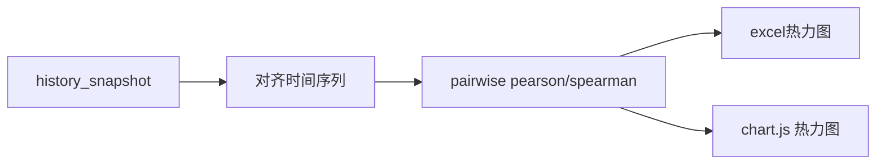

# 分析功能基础增强：相关性矩阵 + 最大回撤 + 净值曲线

> **任务编号**：plan-2（持仓相关性矩阵）／ plan-3（最大回撤+净值曲线）

## 目录

1. [持仓相关性矩阵](#1-持仓相关性矩阵)
2. [最大回撤 + 净值曲线图](#2-最大回撤--净值曲线图)

---

## 1. 持仓相关性矩阵

### 概述

当前报告覆盖了流动性、再平衡、量化指标等多个维度，但缺少最基础的组合分散度分析。新增持仓相关性矩阵页签，计算各品种间的历史价格/收益率相关系数，以热力图形式呈现。

### 收益

- **识别伪分散**：一眼看出持仓是"真分散"还是"全在科技/金融上"，避免被不同基金名称误导
- **再平衡辅助**：高相关性品种间意义不大，可以替换为低相关品种实现真正分散
- **量化指标补全**：组合标准差已算，但缺乏品种间的协方差结构展示
- **现有数据支持**：`fetch_history_data()` 已经有历史净值/价格能力，不依赖新数据源

### 数据源评估

| 品种类型 | 数据源 | 可靠度 | 降级路径 | 已生产使用？ |
|:---------|:-------|:------:|:---------|:-----------:|
| A 股/ETF 日线 | 腾讯 K 线 → 新浪 K 线 | ★★★★☆ | 腾讯→新浪→过期缓存 | ✅ `portfolio_history.py` |
| 场外基金历史净值 | 东方财富 JSONP → 天天基金 HTML | ★★★★★ | 东方财富→天天HTML→过期缓存 | ✅ 同上 |
| 指数 | 腾讯/新浪 K 线 | ★★★★☆ | 同上 | ✅ 同上 |

**结论：不依赖新数据源。** 复用 `fetch_history_data()` 既有链路，日频数据，多品种有双回退保护。

### 风险

- 次新品种（< 60 个交易日）历史数据不足会显示 N/A，需在 UI 明确标注
- 场外基金历史净值分页目前上限 200 条（~10 个月），如需更长的回看窗口（≥3 年）需调大 `pageSize` 阈值

### 架构约束遵从

| 约束 | 适配方式 |
|:-----|:---------|
| **C1** (代码类型判定中心化) | 各品种的数据获取链路选择必须通过 `code_utils.py` 判定资产类型（股票→history_stock、基金→history_fund_otc），不自行实现判定逻辑 |
| **C6** (Provider Chain 必经) | 历史数据获取复用 `fetch_with_incremental_fallback()` 既有链路，不绕过 Chain 直接调 Provider |
| **C2/C3** (缓存统一+原子写入) | 全品种历史数据通过 `cache/` 子包读写，36 场外基金分页参数修改走 `cache/_io.py` 原子写入 |
| **C4** (会话级 API 复用) | 同资产历史数据在会话内通过 DataSourceRegistry.session_cache 消重（与 portfolio_history 共享） |
| **C7** (报告序号可配置) | 相关性矩阵页签必须在 `registry.py` 的 `_REPORT_SECTION_DEFAULT` 注册新条目（type=`b_series`、data_flag=`correlation_data`），支持用户通过 `config.json` 自定义序号和开关 |
| **C14** (渲染期数据不可写入模块级全局变量) | 热力图数据必须通过模板 `render()` 的 context 参数传递，不写入 `_ENV.globals` |
| **C19** (pipeline_data Schema 契约) | 新增 `correlation_data` 键，类型 `dict`，在 pipeline_data Schema 定义集中预定义类型/版本号/写入模块后再使用 |
| **§1.4.5** (数据降级治理) | 品种历史数据不足 60 交易日时标注 `correlation_available=false`，热力图中显示灰色 N/A，不走 DegradationTracker（非数据源故障，系数据量不足） |
| **§1.4.1** (代码类型判定中心化) | 同 C1 |

**对 `rf-1` 的依赖**：相关性矩阵涉及 15+ 品种历史数据获取，若全量串行则每品种 ~1-2s HTTP，合计 15-30s 额外等待。预期 rf-1 批量并行实现后此瓶颈消除（收益 < rf-1 主场景，约 10-20s），可先行实现计算逻辑和渲染，待 rf-1 完成后追加批量获取优化。

### 工作量估算（含架构约束适配）

| 阶段 | 内容 | 天数 |
|------|------|------|
| 纯计算函数 | `analysis/correlation.py` 时间序列对齐 → pairwise Pearson/Spearman + p-value 显著性标记，纯 pandas 运算，不依赖 report/ 模块 | 0.5 |
| 数据获取编排 | `orchestrator.py` 获取全品种历史数据 → 调用纯计算函数 → 结果写入 `pipeline_data['correlation_data']`（C19 新键） | 0.5 |
| 注册与配置 | `registry.py` 新增报告模块条目（C7）+ 两层可见性模型适配 | 0.5 |
| Excel 输出 | 热力图条件格式配色 + 数值表页签 + 数据不足品种 N/A 降级展示（§1.4.5） | 0.5 |
| HTML 输出 | Chart.js 矩阵热力图渲染 + 数据通过模板 context 传递（C14） | 0.5 |
| **合计** | | **2.5 天** |

### 实现思路



- 计算窗口：默认 60 个交易日（约 3 个月）
- 算法：pearson 相关系数 + 双侧 p-value 显著性标记
- 输出：N×N 下三角矩阵，热力图配色（红=正相关/蓝=负相关/白=不显著）

### 数据源可行性分析

plan-2 不依赖新数据源，复用 `fetch_history_data()` 既有链路。

#### API 上限速查

| 数据链路 | API 硬上限 | 当前默认参数 | 3 年(+)可行性 | 改动量 |
|:---------|:----------:|:-----------:|:------------:|:------:|
| A 股/ETF 日 K 线（Tencent→Sina） | **365 天**（代码硬钳位 `min(max(days, 5), 365)`） | `days=30` | 不行（上限 1 年），但 1 年 252 交易日有 113 天余量，改 `days` 参数即可 | 零，调用方只需调参 |
| 指数日 K 线（Sina） | **3650 天**（`datalen` 上限） | `days=30` | ✅ 可行，10 年几乎覆盖成立以来 | 零 |
| 场外基金历史净值（东方财富→天天基金） | 东方财富：**~200 条 ≈ 10 个月**（`max_pages=10`×`pageSize=20`）；天天基金：**无上限**（全量 `pingzhongdata` 保留完整历史） | 全量获取 | ✅ 可行。东方财富改 `max_pages=36` 即可覆盖 3 年；或直接以天天基金为主链路（不分页） | 改 `max_pages=10→36` 或切换主链路 |

#### Provider 代码约束

```python
# Tencent 线 — 硬钳位 365，需改 `providers/tencent.py` 第 245 行
# 当前：days = min(max(days, 5), 365)
# 如果需要 3 年数据，需修改此上限并验证 API 行为
days = min(max(days, 5), 365)

# Sina 指数线 — 硬钳位 3650，3 年绰绰有余
# 当前：days = min(max(days, 5), 3650)

# 东方财富基金净值 — 分页上限 10 页
# 当前：max_pages = 10  # ~200 条 ≈ 10 个月
# 如需 3 年：max_pages = 36
```

#### 风险清单

| 风险 | 原因 | 影响 | 缓解措施 |
|:-----|:------|:----:|:---------|
| **除权除息回溯修正** | 股票分红后 Tencent 回填前复权数据，缓存中的历史价格可能被修正。现有 `_validate_continuity()` 已能自动检测并触发全量刷新 | 偶发缓存 miss，多一次请求 | 已有处理逻辑，无需额外工作 |
| **基金净值更新滞后** | 场外基金 T 日净值在 19:00-22:00 才发布，盘后立即运行报告会缺最新一天 | 最后 1 天数据为 `NaN` | 计算时跳过缺失最后日期，报告中标注"截至前一交易日" |
| **QDII 跨品种汇率干扰** | QDII 基金净值是 CNY 折算后发布，天然含汇率波动，与 A 股相关系数含"伪相关"成分 | 相关性数值微偏 | 报告中注明"QDII 含汇率影响"，不阻断 |
| **品种不足 < 60 条** | 次新基金/刚调入品种历史数据不够计算窗口 | 相关性矩阵出现空白格 | 灰色+N/A 标注，不影响其余格 |
| **计算复杂度 O(N²)** | 20 品种 → 190 对，50 品种 → 1225 对。纯内存计算 | < 10ms（20 品种）/ < 100ms（50 品种），非瓶颈 | 无需额外优化 |
| **缓存 TTL = CACHE_WEEKLY** | 走势数据本身不变（历史已发生），但每周重新请求一次 | 冗余网络 IO，每个品种每周一次 | 可考虑改为 `CACHE_MONTHLY` 但非当前问题 |
| **Tencent 365 天上限** | A 股 K 线代码硬钳位，无法获取 1 年以上历史 | 回看窗口 ≤ 365 交易日 ≈ 1.5 自然年 | 如果需要更长时间窗口，需评估 Sina 链路是否支持更长时间范围；或采用从 start_from 增量累积策略来突破上限 |
| **天天基金历史数据完整性** | 备用链路能否提供完整历史未经大规模验证 | 部分品种可能只能拿到 10 个月数据 | 实现前先抽样 5-10 只基金对比两链路的数据长度 |

#### 可行性评级

| 回看窗口 | 场内股票/ETF | 场外基金 | 指数 |
|:---------|:-----------:|:--------:|:----:|
| 60 日（默认） | ✅ 现成可用 | ✅ 现成可用 | ✅ 现成可用 |
| 1 年（252 交易日） | ✅ 调参即用 | ✅ 现成可用（已有 200 条缓存积累） | ✅ 调参即用 |
| 3 年 | ❌ Tencent 上限 365 天，需评估 Sina 支持度 | ✅ 调大 `max_pages=36` 或切天天为主链路 | ✅ 现成可用 |
| 5 年+ | ❌ 同上，或需累积缓存策略 | ✅ 同上 | ✅ 现成可用 |

**实施建议**：MVP 阶段默认 1 年窗口，后续根据用户反馈调长时间范围。

---

## 2. 最大回撤分析 + 净值曲线图

### 概述

当前有卡玛比率（隐含最大回撤），但没有单独的最大回撤分析。新增净值曲线图 + 最大回撤标注 + 回撤恢复时间明细。

### 收益

- **比夏普更直观**：夏普 0.8 vs 1.2 对普通投资者无感，"曾经跌过 30%，花了 8 个月才恢复"一眼看清
- **识别尾部风险**：多个品种的最大回撤集中在同一时段，说明系统性风险暴露
- **度量恢复能力**：回撤恢复时间比最大回撤深度更能反映品种质量
- **快速构建**：数据分析已有 `compute_all_metrics()` 含最大回撤计算，只缺展示层

### 风险

- 净值曲线对时间范围敏感：选取 1 年 vs 3 年 vs 成立以来的结果差异很大
- 部分品种历史数据短（如次新基金），曲线缺乏参考意义
- 需避免净值回测的 survivorship bias 暗示

#### 数据源说明

最大回撤依赖与 §1 完全相同的 `fetch_history_data()` 数据链，不再重复评估。差异在于：

1. **数据需求更长**：最大回撤的"有效分析"通常需要 ≥3 年数据（才能覆盖一次完整牛熊），而 A 股 K 线 API 上限 365 天。
   - 实际影响：对于股票/ETF，365 天窗口内的最大回撤仍有参考价值（A 股波动大，1 年内也有显著回撤）
   - 场外基金：东方财富 200 条 ≈ 10 个月，对回撤分析偏短，推荐切天天基金链路（无上限）
2. **净值曲线 vs K 线**：指数走势直接复用 `fetch_index_kline`，指数 K 线 Sina 链路支持 **3650 天**（10 年），充分满足需求
3. **缓存一致性**：净值曲线和相关性矩阵共享同一份 K 线缓存，不会重复请求

#### 实施建议

- 股票/ETF：使用 365 天可获取的上限数据
- 场外基金：方案一（东方财富 `max_pages=36`），方案二（天天基金主链路）
- 指数：直接使用全量 3-5 年数据（Sina 3650 天上限绰绰有余）

### 架构约束遵从

| 约束 | 适配方式 |
|:-----|:---------|
| **C7** (报告序号可配置) | `drawdown_analysis` 已在 `registry.py` 注册（type=history、number=16），增强内容不新增报告模块，不需修改注册表 |
| **C14** (渲染期数据不可写入模块级全局变量) | 所有新数据通过 `history_data` 模板 context 传递，沿用现有 `render()` context 参数机制，不写入 `_ENV.globals` |
| **C19** (pipeline_data Schema 契约) | 新增 `drawdown_events`（list[dict]: peak_date/trough_date/recovery_date/drawdown_pct）和 `recovery_times`（list[dict]: start_date/end_date/days）字段需在 pipeline_data Schema 定义集中预定义类型/版本号/写入模块，与已有 `max_drawdown_pct`/`drawdown_start`/`drawdown_end` 共同纳入 schema 管理 |
| **§1.4.5** (数据降级治理) | 全量历史 span < 60 交易日时，`drawdown_analysis` 标记 `drawdown_available=false`，回撤分析章节显示"数据不足"占位文本，不走 DegradationTracker（系数据量不足，非数据源故障） |
| **C6** (Provider Chain 必经) | 同 §1——复用 `fetch_with_incremental_fallback()` 既有链路 |
| **C2/C3** (缓存统一+原子写入) | 同 §1——复用既有 `cache/` 子包 |

**对 plan-1 的依赖**：当前 drawdown 图表使用 Canvas 2D API 原生渲染（`drawSimpleChart`），plan-3 计划升级为 Chart.js 双轴图（净值线 + 回撤填充）。Chart.js 迁移由 plan-1 统一实施，plan-3 需在 plan-1 完成后适配模板参数。若 plan-1 搁置或推迟，plan-3 可回退在现有 Canvas 2D 框架内增强标注（添加回撤区间阴影标注 + 恢复时间水印），不阻塞。

### 工作量估算（含架构约束适配）

| 阶段 | 内容 | 天数 |
|------|------|------|
| C19 Schema 定义 | `drawdown_events` / `recovery_times` 字段预定义类型/版本号/写入模块，更新 pipeline_data Schema 文档 | 0.25 |
| 数据加工 | `portfolio_history.py` 提取独立回撤事件（从 bars 逐日 drawdown 序列检测峰谷→合并连续回撤区间→计算恢复时间），纯计算不依赖 report/ 模块 | 0.5 |
| Excel 输出 | 新增历史回撤明细页签内容：回撤序号/起始日/最深日/恢复日/幅度/持续天数 | 0.5 |
| HTML 增强 | 图表标注（回撤区间阴影/恢复时间水印）+ 回撤明细表格 + 数据不足占位处理（§1.4.5） | 0.5 |
| 模板渲染适配 | 新增数据通过模板 context 传递（C14 约束） | 0.25 |
| **合计** | | **2 天** |

> Chart.js 双轴图部分由 plan-1 统一实施，本估算不含 Chart.js 迁移费用。

### 实现思路

- 复用的历史净值数据（同相关性矩阵共享缓存）
- HTML 图表设计：上证指数背景线 + 组合净值线 + 最大回撤阴影标注
- 输出表：品种 / 最大回撤 / 发生日期 / 恢复日期 / 恢复耗时(天) / 当前是否已恢复
